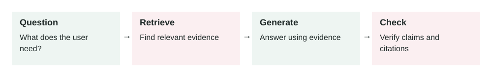

# Retrieval-Augmented Generation (RAG)

2026-06-25 · Archived lesson · Original lesson text; technical claims not rechecked

Figure 1. Original study diagram added on 7 October 2026 to summarize this archived lesson. Each stage follows the previous stage; review may send the task back for correction.

## 1\. What RAG Means

**Retrieval-Augmented Generation**, usually called **RAG**, is a method where an AI searches your data before answering a question.

A normal language model answers mainly from knowledge learned during training. A RAG system adds an external knowledge source, such as:

-   Company documents
-   Product manuals
-   Support articles
-   Database records
-   Policies and procedures
-   Research papers

Think of RAG as an **open-book exam**:

1.  The user asks a question.
2.  The system searches relevant documents.
3.  It gives the best document sections to the model.
4.  The model writes an answer using that evidence.

RAG does not permanently teach the model new facts. It gives the model useful information for the current request.

* * *

## 2\. Why RAG Matters

Language models have several limitations:

-   Their training knowledge may be outdated.
-   They do not know private company information.
-   They may confidently invent facts.
-   Retraining them whenever information changes is expensive.

RAG helps because documents can be updated without retraining the model.

For example, when a refund policy changes, you update the policy document. Future answers can immediately use the new policy.

However, RAG does not automatically guarantee correct answers. If retrieval returns the wrong document, the model may still produce a wrong answer.

* * *

## 3\. How RAG Works

### Step 1: Prepare documents

Collect trusted information and remove outdated or duplicate content.

Large documents are divided into smaller sections called **chunks**. A chunk might contain two or three paragraphs about one topic.

### Step 2: Create embeddings

An **embedding** is a numerical representation of meaning.

For example, these sentences have different words but similar meanings:

-   “How can I cancel my subscription?”
-   “I want to stop my paid plan.”

Their embeddings should be close together.

The system stores document chunks and their embeddings in a searchable index, often called a **vector database**.

### Step 3: Search

When a user asks a question, the system creates an embedding for that question.

It searches for document chunks with similar meanings.

The system may retrieve five chunks, for example.

### Step 4: Rerank results

Initial search results are not always ordered correctly.

A **reranker** examines the question and retrieved chunks more carefully, then moves the most useful chunks to the top.

### Step 5: Build the prompt

The application sends the model:

-   System instructions
-   User’s question
-   Retrieved document chunks
-   Rules for using those chunks

A useful rule might be:

> Answer only from the supplied sources. If the sources do not contain the answer, say that you cannot find it.

### Step 6: Generate the answer

The model reads the retrieved information and creates an answer.

A production system should usually include citations so the user can inspect the source.

* * *

## 4\. Applying RAG in a Project

Start with a narrow use case. Do not index every company document immediately.

A practical implementation process is:

1.  Select one trusted document collection.
2.  Clean and divide the documents into chunks.
3.  Attach metadata such as title, date, category, and access level.
4.  Generate embeddings and index the chunks.
5.  Retrieve several chunks for each question.
6.  Rerank them when necessary.
7.  Ask the model to answer from retrieved evidence.
8.  Return citations with the answer.
9.  Test retrieval and answer quality separately.
10.  Monitor unanswered and incorrect questions.

Security must be applied during retrieval. A user should never retrieve documents they are not allowed to access.

* * *

## 5\. Real-World Example: Customer Support

Imagine a software company with these documents:

-   Pricing guide
-   Refund policy
-   Account cancellation guide
-   Enterprise contract rules

A customer asks:

> Can I receive a refund if I cancel my annual plan after 20 days?

The RAG system:

1.  Searches the support documents.
2.  Retrieves the annual-plan refund section.
3.  Finds that annual plans have a 30-day refund period.
4.  Gives that section to the model.
5.  Produces an answer explaining that the customer is eligible.
6.  Includes a link to the refund policy.

Without RAG, the model might invent a 14-day limit or use an old policy.

The outcome is a more reliable answer that support staff and customers can verify.

* * *

## 6\. Real-World Example: Internal Engineering Assistant

An engineering company has:

-   Architecture documents
-   Deployment guides
-   Incident reports
-   API documentation

A developer asks:

> How do I deploy the payment service to production?

The system retrieves:

-   The current deployment guide
-   Required approval rules
-   Rollback instructions

The assistant then returns the exact deployment process and links to those documents.

Metadata filters are important here. The system should prefer:

-   Production documents
-   The latest approved version
-   Documents for the payment service
-   Content the developer can access

Without these filters, it might retrieve an old staging deployment guide and provide dangerous instructions.

* * *

## 7\. Common Mistakes and Trade-offs

**Poor document quality:** RAG cannot fix incorrect source documents.

**Bad chunking:** Very small chunks lose context. Very large chunks add irrelevant information and increase cost.

**Retrieving by similarity only:** A semantically similar document may still be outdated or unauthorized.

**Too many retrieved chunks:** More context is not always better. Irrelevant text can confuse the model.

**No citations:** Users cannot verify where the answer came from.

**Ignoring missing evidence:** The model should admit when the retrieved documents do not contain an answer.

**Higher latency:** Retrieval and reranking add extra processing time.

**Higher complexity:** You must maintain document ingestion, indexes, permissions, retrieval, evaluation, and monitoring.

* * *

## 8\. Practical Best Practices

-   Index only trusted and approved sources.
-   Store document dates, versions, owners, and permissions as metadata.
-   Use access controls before sending retrieved content to the model.
-   Prefer a small number of highly relevant chunks.
-   Require citations for factual claims.
-   Test whether the correct document was retrieved.
-   Test whether the final answer correctly used that document.
-   Log retrieved document IDs for debugging.
-   Re-index changed or deleted documents quickly.
-   Let the system say “I don’t know” when evidence is missing.

The key production lesson is:

**RAG quality depends more on retrieving the right evidence than on writing a clever prompt.**

## Practice

Your company has 10,000 documents, including old policies, drafts, and confidential files.

Before building a RAG assistant, what rules would you create to decide:

1.  Which documents can be indexed?
2.  Which users can retrieve each document?
3.  How should the system handle conflicting document versions?

Primary source: [Retrieval-Augmented Generation for Knowledge-Intensive NLP Tasks](https://arxiv.org/abs/2005.11401) ([arxiv.org](https://arxiv.org/abs/2005.11401?utm_source=openai))
