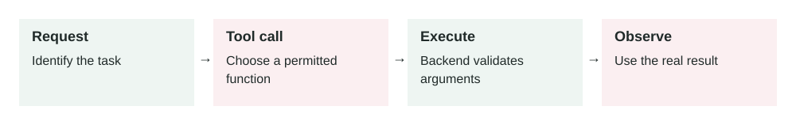

# Tool Use in AI Agents

2026-06-26 · Archived lesson · Original lesson text; technical claims not rechecked



Figure 2. Original study diagram added on 7 October 2026 to summarize this archived lesson. Each stage follows the previous stage; review may send the task back for correction.

## <a id="lesson-2-section-1"></a>1\. What It Means

**Tool use** means an AI model can call an external function, API, database, search system, calculator, file reader, or business system instead of only answering from its own text knowledge.

A normal chatbot only produces text.

A tool-using agent can do things like:

-   Search your company documents
-   Check an order status
-   Create a support ticket
-   Read a calendar
-   Run code
-   Query a database
-   Send an email after approval
-   Calculate exact numbers

The important idea is simple:

> The AI decides what tool is needed, sends structured input to that tool, receives the result, then uses that result to continue the task.

A tool usually has three parts:

-   **Name:** what the tool is called, for example `get_order_status`
-   **Input schema:** what information the tool needs, for example `{ "order_id": "12345" }`
-   **Output:** what the tool returns, for example `{ "status": "shipped", "delivery_date": "2026-06-28" }`

The model should not guess when a tool can provide the real answer.

* * *

## <a id="lesson-2-section-2"></a>2\. Why It Matters in Production Systems

Tool use is one of the main differences between a demo chatbot and a useful production agent.

Without tools, the AI can only generate possible answers. That is risky for real systems.

For example:

-   It may guess a customer’s refund status.
-   It may invent a database result.
-   It may give outdated pricing.
-   It may say an action was completed when nothing happened.

With tools, the agent can connect to real systems.

This matters because production systems need:

-   **Accuracy:** use live data instead of guesses
-   **Action:** actually perform tasks, not just explain them
-   **Security:** restrict what the AI can access or change
-   **Auditability:** log every tool call and result
-   **Reliability:** retry failed operations or ask for missing information
-   **Control:** require approval before dangerous actions

Tool use makes AI more useful, but also more dangerous if designed badly. A tool-using agent can affect real users, real money, and real data.

* * *

## <a id="lesson-2-section-3"></a>3\. How It Works Step by Step

A typical tool-use flow looks like this:

1.  **User asks for something**

    Example:

    > “Where is my order #A1928?”

2.  **Model understands the task**

    The model sees that this question requires live order data. It should not answer from memory.

3.  **Model selects a tool**

    It chooses something like:

    ```json
    {
      "tool": "get_order_status",
      "input": {
        "order_id": "A1928"
      }
    }
    ```

4.  **System runs the tool**

    The real backend calls the order database or shipping API.

5.  **Tool returns data**

    Example:

    ```json
    {
      "order_id": "A1928",
      "status": "in_transit",
      "carrier": "DHL",
      "estimated_delivery": "2026-06-29"
    }
    ```

6.  **Model writes the answer**

    The model converts the tool result into simple language:

    > “Your order A1928 is in transit with DHL. Estimated delivery is June 29, 2026.”

7.  **System logs the action**

    In production, you should log:

    -   User request
    -   Tool selected
    -   Tool input
    -   Tool output
    -   Final answer
    -   Errors or retries

This log helps with debugging, security reviews, and quality improvement.

* * *

## <a id="lesson-2-section-4"></a>4\. How To Apply It In A Project

Start small. Do not give the agent too many tools at once.

A practical implementation plan:

1.  **Pick one clear workflow**

    Example:

    -   “Check order status”
    -   “Create support ticket”
    -   “Find internal policy”
    -   “Summarize customer account”
2.  **Design one tool with a strict schema**

    Example:

    ```json
    {
      "name": "get_order_status",
      "description": "Fetch the current shipping status for one customer order.",
      "input": {
        "order_id": "string"
      }
    }
    ```

3.  **Make the tool do one thing well**

    Avoid a giant tool like `manage_customer`. That is too broad.

    Prefer smaller tools:

    -   `get_customer_profile`
    -   `get_order_status`
    -   `create_refund_request`
    -   `create_support_ticket`
4.  **Add permission checks outside the model**

    Never trust the model alone for security.

    The backend should check:

    -   Is this user allowed to access this order?
    -   Is this action allowed?
    -   Does this action need human approval?
5.  **Add safe failure behavior**

    If the tool fails, the model should say:

    > “I could not check the order right now. Please try again later.”

    It should not invent the answer.

6.  **Test with real scenarios**

    Test normal, missing, invalid, and risky inputs.

    Example test cases:

    -   Valid order ID
    -   Order ID from another user
    -   Missing order ID
    -   Fake order ID
    -   Tool timeout
    -   User asks for a refund instead of status

* * *

## <a id="lesson-2-section-5"></a>5\. Real-World Example 1: Customer Support Agent

**Use case:** An ecommerce company wants an AI assistant to answer order questions.

**User input:**

> “Has my order 88421 shipped?”

**Agent behavior:**

The agent should call:

```json
{
  "tool": "get_order_status",
  "input": {
    "order_id": "88421"
  }
}
```

**Tool result:**

```json
{
  "status": "shipped",
  "carrier": "FedEx",
  "tracking_number": "FX29301",
  "estimated_delivery": "2026-06-27"
}
```

**Final answer:**

> “Yes. Your order 88421 has shipped with FedEx. The estimated delivery date is June 27, 2026.”

**Good outcome:**

The answer is based on live order data.

**Bad design risk:**

If the agent only guesses, it may say the order shipped when it did not. That creates customer frustration and support cost.

**Production detail:**

The backend must verify that the logged-in customer owns order `88421`. The model should not decide that by itself.

* * *

## <a id="lesson-2-section-6"></a>6\. Real-World Example 2: Internal Sales Assistant

**Use case:** A sales team wants an AI assistant that prepares account summaries before calls.

**User input:**

> “Prepare a quick summary for Acme Corp before my meeting.”

The agent may need multiple tools:

```json
{
  "tool": "get_crm_account",
  "input": {
    "company_name": "Acme Corp"
  }
}
```

Then:

```json
{
  "tool": "get_recent_support_tickets",
  "input": {
    "account_id": "acct_781"
  }
}
```

Then:

```json
{
  "tool": "get_open_opportunities",
  "input": {
    "account_id": "acct_781"
  }
}
```

**Tool results may show:**

-   Acme is a current customer.
-   They have 3 open support tickets.
-   One renewal opportunity is worth `$80,000`.
-   Last meeting note says they are concerned about onboarding speed.

**Final answer:**

> “Acme Corp is an active customer with an $80,000 renewal opportunity. They currently have 3 open support tickets, mostly about onboarding speed. In the meeting, focus on support resolution, renewal risk, and next onboarding milestones.”

**Good outcome:**

The salesperson gets a useful, current briefing.

**Bad design risk:**

The agent may expose sensitive CRM data to the wrong employee if permission checks are weak.

**Production detail:**

Each tool should respect the user’s role. A junior salesperson may not be allowed to see enterprise pricing or legal notes.

* * *

## <a id="lesson-2-section-7"></a>7\. Common Mistakes, Risks, And Trade-Offs

**Mistake 1: Too many tools**

If the agent has 40 tools, it may choose the wrong one.

Better: start with a small set of high-value tools.

**Mistake 2: Tool descriptions are unclear**

Bad description:

> “Gets data.”

Good description:

> “Fetches the shipping status for one order owned by the current user.”

Clear descriptions help the model choose correctly.

**Mistake 3: No permission checks**

The model should not be your security layer.

Always enforce permissions in backend code.

**Mistake 4: Letting the agent perform dangerous actions too easily**

Actions like refunds, deleting data, sending emails, or changing billing plans should often require confirmation.

Example:

> “I can create a refund request for $120. Do you want me to continue?”

**Mistake 5: Trusting tool output blindly**

Tools can fail, return old data, or return partial data.

The system should handle:

-   Empty results
-   Timeouts
-   Permission errors
-   Invalid input
-   Conflicting data

**Trade-off: More power means more risk**

Tool use makes agents much more useful, but each tool increases the attack surface.

An **attack surface** means the number of ways something can be misused or attacked.

For example, if an agent can send emails, a malicious user may try to trick it into sending private information.

* * *

## <a id="lesson-2-section-8"></a>8\. Practical Best Practices

Use these rules when building tool-using agents:

1.  **Make tools narrow**

    One tool should do one clear job.

2.  **Use strict input schemas**

    Do not accept messy free text when structured fields are possible.

3.  **Validate inputs in backend code**

    Check types, IDs, ownership, and permissions.

4.  **Separate read tools and write tools**

    Reading data is usually lower risk.

    Writing data, sending messages, deleting records, or charging money is higher risk.

5.  **Require approval for high-risk actions**

    Example high-risk actions:

    -   Send email
    -   Issue refund
    -   Delete record
    -   Change subscription
    -   Share private data
6.  **Log every tool call**

    Logs help answer:

    -   What happened?
    -   Why did the agent do that?
    -   What data did it use?
    -   Did the tool fail?
7.  **Give the model error-handling instructions**

    Example:

    > “If the tool returns no result, say you could not find the order. Do not invent an order status.”

8.  **Test tool selection**

    Do not only test the final answer.

    Test whether the agent picked the correct tool with the correct input.


* * *

## <a id="lesson-2-section-9"></a>9\. Small Practice Exercise

Imagine you are building an AI assistant for a clinic.

A patient asks:

> “Can you move my appointment with Dr. Ahmed from Monday to Wednesday?”

Question:

What tools would you create?

Think about:

-   What read tool is needed first?
-   What write tool is needed later?
-   What permission check is required?
-   Should the agent ask for confirmation before changing the appointment?

A strong answer might include tools like:

-   `get_patient_appointments`
-   `check_doctor_availability`
-   `reschedule_appointment`

And it should require confirmation before the final change.
