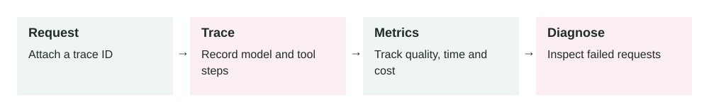

# Observability for AI Systems

2026-06-28 · Archived lesson · Original lesson text; technical claims not rechecked



Figure 4. Original study diagram added on 7 October 2026 to summarize this archived lesson. Each stage follows the previous stage; review may send the task back for correction.

## <a id="lesson-4-section-1"></a>1\. What It Means

**Observability** means you can understand what your AI system is doing in production by looking at its records.

In normal software, observability usually means collecting:

-   **Logs:** written events, like “request failed”
-   **Metrics:** numbers over time, like latency, cost, error rate
-   **Traces:** step-by-step paths of one request through the system

OpenTelemetry describes these as core signals used to understand system behavior. Source: [https://opentelemetry.io/docs/concepts/observability-primer/](https://opentelemetry.io/docs/concepts/observability-primer/)

For Generative AI systems, observability needs extra details because the output is not always predictable.

You may need to track:

-   User input
-   System prompt version
-   Model name
-   Retrieved documents
-   Tool calls
-   Tool results
-   Token usage
-   Cost
-   Latency
-   Safety blocks
-   Final answer
-   User feedback
-   Evaluation score

The simple idea:

> Observability helps you answer: “What happened, why did it happen, and how do we fix it?”

* * *

## <a id="lesson-4-section-2"></a>2\. Why It Matters In Production Systems

AI systems fail differently from normal software.

A normal API may fail with a clear error:

> `500 Internal Server Error`

An AI system may fail more quietly:

-   It gives a confident but wrong answer.
-   It uses the wrong document.
-   It calls the wrong tool.
-   It ignores an important instruction.
-   It becomes slower after a prompt change.
-   It costs more after a model change.
-   It answers correctly for simple users but fails for edge cases.

Without observability, you only see the final answer. That is not enough.

In production, you need to know:

-   Did retrieval return the right documents?
-   Did the model use the retrieved context?
-   Which prompt version caused the issue?
-   Did a tool fail?
-   Was the answer blocked by a guardrail?
-   Did cost increase after release?
-   Did latency become worse for large inputs?

Observability is how you debug, improve, and control an AI product after real users start using it.

* * *

## <a id="lesson-4-section-3"></a>3\. How It Works Step By Step

Imagine a user asks:

> “Can I get a refund for my damaged item?”

A well-observed AI system records the full path.

1.  **Request starts**

    The system creates a unique `request_id`.

    Example:

    ```json
    {
      "request_id": "req_9241",
      "user_id": "user_77",
      "feature": "support_assistant"
    }
    ```

2.  **Input is recorded safely**

    The system logs the user question.

    Sensitive data should be masked.

    Example:

    ```json
    {
      "input": "Can I get a refund for my damaged item?",
      "contains_sensitive_data": false
    }
    ```

3.  **Prompt version is recorded**

    You track which prompt was used.

    ```json
    {
      "prompt_version": "refund-support-v3"
    }
    ```

4.  **Retrieval is recorded**

    If the system uses RAG, log what documents were retrieved.

    ```json
    {
      "retrieved_docs": [
        {
          "doc_id": "refund_policy_2026",
          "score": 0.91
        },
        {
          "doc_id": "damaged_items_policy",
          "score": 0.87
        }
      ]
    }
    ```

5.  **Tool calls are recorded**

    If the AI checks order history, log that.

    ```json
    {
      "tool": "get_order_status",
      "input": {
        "order_id": "masked"
      },
      "status": "success"
    }
    ```

6.  **Model output is recorded**

    The final answer is stored for debugging and quality review.

7.  **Metrics are updated**

    Example metrics:

    -   Latency: `2.4 seconds`
    -   Cost: `$0.018`
    -   Tokens: `2,100`
    -   Tool calls: `1`
    -   Retrieval count: `2`
    -   Safety blocked: `false`
8.  **Feedback is captured**

    The user may click thumbs up/down.

    Support agents may mark the answer as correct or incorrect.


* * *

## <a id="lesson-4-section-4"></a>4\. How To Apply It In A Project

Start with a simple observability plan.

Do not try to track everything on day one. Track the things needed to debug real problems.

A practical setup:

1.  **Create a request ID**

    Every AI request should have one ID that connects logs, tool calls, retrieval, and final output.

2.  **Log the AI pipeline steps**

    For example:

    -   User request received
    -   Retrieval started
    -   Documents returned
    -   Model called
    -   Tool called
    -   Guardrail checked
    -   Final answer returned
3.  **Track important metrics**

    Minimum useful metrics:

    -   Request count
    -   Error rate
    -   Average latency
    -   Cost per request
    -   Token usage
    -   Tool failure rate
    -   Retrieval empty-result rate
    -   User satisfaction score
4.  **Version prompts and models**

    Always record:

    -   Prompt version
    -   Model name
    -   Retrieval config version
    -   Tool schema version

    This helps you compare behavior before and after changes.

5.  **Protect private data**

    Observability should not become a data leak.

    Mask or remove:

    -   Passwords
    -   API keys
    -   Payment details
    -   Private personal data
    -   Medical or legal sensitive text, depending on your domain
6.  **Build dashboards**

    Useful dashboard sections:

    -   Quality
    -   Cost
    -   Latency
    -   Errors
    -   Tool failures
    -   Safety blocks
    -   Top failing user intents
7.  **Use traces for complex agents**

    If an agent has multiple steps, trace each step.

    Example trace:

    ```text
    user_request
      -> classify_intent
      -> retrieve_policy_docs
      -> call_order_tool
      -> generate_answer
      -> output_guardrail
    ```


* * *

## <a id="lesson-4-section-5"></a>5\. Real-World Example 1: Customer Support Chatbot

**Use case:** An ecommerce company has an AI chatbot that answers refund questions.

**User input:**

> “My headphones arrived broken. Can I get my money back?”

**Expected behavior:**

The assistant should:

1.  Retrieve refund policy.
2.  Check order status.
3.  Explain the refund process.
4.  Avoid promising a refund if approval is required.

**Observed production issue:**

Customers complain:

> “The bot says I am not eligible, but support says I am eligible.”

Without observability, you only see bad final answers.

With observability, you inspect failed requests and find:

```json
{
  "retrieved_docs": [
    {
      "doc_id": "standard_return_policy",
      "score": 0.89
    }
  ],
  "missing_doc": "damaged_items_policy",
  "final_answer": "This item is not eligible after opening."
}
```

**What you learn:**

The retrieval system returned the general return policy but missed the damaged item policy.

**Fix:**

-   Improve document chunking.
-   Add metadata like `policy_type: damaged_item`.
-   Add an evaluation case for damaged products.
-   Monitor retrieval misses for refund questions.

**Outcome:**

The answer improves because you found the real failure layer: retrieval, not the model.

* * *

## <a id="lesson-4-section-6"></a>6\. Real-World Example 2: Sales Email Agent

**Use case:** A sales team uses an AI agent to draft follow-up emails after calls.

**User input:**

> “Write a follow-up email for Acme Corp after today’s meeting.”

The agent uses:

-   CRM notes
-   Meeting transcript
-   Pricing plan data
-   Email draft tool

**Observed production issue:**

The sales manager says:

> “The emails are good, but the system became too expensive this week.”

With observability, you compare metrics.

Before prompt change:

```json
{
  "avg_tokens": 1800,
  "avg_cost": 0.02,
  "avg_latency_seconds": 3.1
}
```

After prompt change:

```json
{
  "avg_tokens": 6200,
  "avg_cost": 0.07,
  "avg_latency_seconds": 7.8
}
```

Then you inspect traces and find:

```json
{
  "retrieved_crm_notes": 25,
  "used_notes_in_answer": 4
}
```

**What you learn:**

The agent retrieves too many CRM notes. Most are not useful.

**Fix:**

-   Retrieve only the top 5 relevant notes.
-   Summarize long meeting transcripts before final generation.
-   Add a token budget.
-   Monitor cost per email.

**Outcome:**

The agent keeps email quality but reduces cost and latency.

* * *

## <a id="lesson-4-section-7"></a>7\. Common Mistakes, Risks, And Trade-Offs

**Mistake 1: Only logging final answers**

Final answers do not explain why something happened.

You also need intermediate steps:

-   Prompt version
-   Retrieved documents
-   Tool calls
-   Model settings
-   Guardrail result

**Mistake 2: Logging sensitive data**

Logs are often seen by engineers, vendors, or monitoring tools.

Never carelessly log:

-   Passwords
-   Access tokens
-   Full payment details
-   Private customer data
-   Medical records
-   Confidential contracts

**Mistake 3: No prompt or model versioning**

If behavior changes, you need to know what changed.

Without versions, debugging becomes slow.

**Mistake 4: Too many metrics, no useful questions**

Do not collect random data.

Start from questions like:

-   Why did this answer fail?
-   Why did cost increase?
-   Why did latency increase?
-   Which tool fails most often?
-   Which user intents get bad ratings?

**Mistake 5: No sampling strategy**

Full logs for every request can become expensive.

A **sampling strategy** means deciding which requests to store in detail.

Example:

-   Store all failed requests.
-   Store all safety-blocked requests.
-   Store 5% of successful requests.
-   Store high-cost requests.

**Trade-off: Debugging vs privacy**

More logs make debugging easier.

Less logging protects privacy and reduces cost.

Production systems need a careful balance.

* * *

## <a id="lesson-4-section-8"></a>8\. Practical Best Practices

Use these rules:

1.  **Track one request across the full journey**

    Use a `request_id` everywhere.

2.  **Log decisions, not just messages**

    Record why the system chose retrieval, a tool, or a refusal.

3.  **Measure quality, cost, and speed together**

    A better answer is not enough if it is too slow or too expensive.

4.  **Record versions**

    Track:

    -   Prompt version
    -   Model version
    -   Tool version
    -   Retrieval config version
    -   Guardrail version
5.  **Mask sensitive data**

    Use redaction before logs leave your system.

    **Redaction** means removing or hiding sensitive values.

6.  **Create alerts**

    Useful alerts:

    -   Cost per request increased by 50%
    -   Tool failures above 5%
    -   Latency above 10 seconds
    -   Retrieval returns zero documents
    -   Safety blocks suddenly increase
7.  **Connect observability to evaluations**

    If users downvote an answer, convert it into a future test case.

8.  **Review real failures weekly**

    Pick a few bad traces and ask:

    -   Was the input unclear?
    -   Was retrieval wrong?
    -   Was the prompt weak?
    -   Did a tool fail?
    -   Did the model ignore evidence?
    -   Do we need a guardrail?

* * *

## <a id="lesson-4-section-9"></a>9\. Small Practice Exercise

Imagine you are building an AI assistant that helps users understand invoices.

A user asks:

> “Why is my bill higher this month?”

Design an observability plan.

Answer these:

1.  What request data should you log?
2.  What tool calls should you trace?
3.  What metrics should you track?
4.  What sensitive data should be masked?
5.  What alert would help you catch production problems?

A strong answer should include:

-   Request ID
-   User/account permission check
-   Invoice lookup tool call
-   Retrieved billing policy
-   Final explanation
-   Latency
-   Token usage
-   Cost
-   Tool failure rate
-   Masked payment or personal data
-   Alert for high tool failures or sudden cost increase
