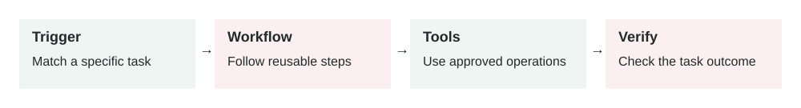

# Agent Skills

2026-06-29 · Archived lesson · Original lesson text; technical claims not rechecked



Figure 5. Original study diagram added on 7 October 2026 to summarize this archived lesson. Each stage follows the previous stage; review may send the task back for correction.

## <a id="lesson-5-section-1"></a>1\. What It Means

An **agent skill** is a reusable capability that tells an AI agent how to do a specific kind of task.

A skill is more than a prompt. It usually includes:

-   **When to use it:** the trigger condition
-   **What steps to follow:** the workflow
-   **What tools are allowed:** APIs, files, browser, database, etc.
-   **What rules matter:** security, quality, style, edge cases
-   **What output should look like:** format, structure, success criteria
-   **How to verify the work:** tests, checks, review steps

Simple meaning:

> A skill is a small operating manual for one repeatable job.

Example skills:

-   “Review a pull request”
-   “Write a customer support reply”
-   “Debug a failing CI job”
-   “Analyze a sales dashboard”
-   “Create a lesson”
-   “Summarize legal documents”
-   “Prepare a meeting brief”

Agent skills are related to the general agent idea of **reasoning and acting**: the model decides what to do, uses tools or external systems, observes results, and continues. A useful source on this pattern is the ReAct paper: [https://arxiv.org/abs/2210.03629](https://arxiv.org/abs/2210.03629)

* * *

## <a id="lesson-5-section-2"></a>2\. Why It Matters In Production Systems

Without skills, agents often behave inconsistently.

One day the agent handles a task well. Another day it forgets an important step.

In production, this is a problem because teams need:

-   Repeatable behavior
-   Clear task boundaries
-   Fewer mistakes
-   Better tool use
-   Easier testing
-   Easier improvement over time
-   Safer handling of sensitive tasks

Skills help turn a general AI model into a more reliable worker for specific workflows.

For example, a generic AI can “review code.” But a skilled code-review agent knows:

-   Start with bugs and risks
-   Use file and line references
-   Check security issues
-   Mention missing tests
-   Avoid style-only comments unless important
-   Do not rewrite unrelated code

That is much closer to production behavior.

* * *

## <a id="lesson-5-section-3"></a>3\. How It Works Step By Step

A skill usually works like this:

1.  **User asks for a task**

    Example:

    > “Review this PR.”

2.  **Agent detects the right skill**

    The system matches the task to a skill called `code-review`.

3.  **Agent loads the skill instructions**

    The skill may say:

    -   Read the diff first
    -   Focus on correctness, security, and regressions
    -   Report findings by severity
    -   Include file and line references
    -   Do not summarize before listing issues
4.  **Agent uses tools**

    It may call:

    -   Git diff
    -   File search
    -   Test runner
    -   Static analysis
    -   GitHub comments
5.  **Agent follows the skill workflow**

    It does not just answer randomly. It follows the process.

6.  **Agent verifies the result**

    It may run tests or check that findings are linked to real code.

7.  **Agent produces the expected output**

    Example:

    ```text
    Findings:
    - High: Missing authorization check in ...
    - Medium: Retry loop can duplicate payment request ...
    ```


The skill gives structure. The model still reasons, but inside a clearer process.

* * *

## <a id="lesson-5-section-4"></a>4\. How To Apply It In A Project

Start with tasks that repeat often.

Good first skill candidates:

-   Customer support triage
-   Bug diagnosis
-   Pull request review
-   Report generation
-   Data analysis
-   Deployment checklist
-   Security review
-   Document summarization

A practical skill template:

```md
# Skill: Support Ticket Triage

## Use When
The user asks to classify or prioritize customer support tickets.

## Goal
Classify tickets by urgency, topic, owner, and next action.

## Steps
1. Read the ticket.
2. Identify customer impact.
3. Detect security, billing, or outage risk.
4. Assign priority.
5. Suggest the next action.
6. If information is missing, ask one clear question.

## Rules
- Do not promise refunds.
- Do not expose private customer data.
- Escalate security issues.
- Use simple customer-safe language.

## Output Format
- Priority:
- Topic:
- Reason:
- Next action:
- Escalation needed:
```

Good skills are small and specific.

Bad:

> “Be a business assistant.”

Better:

> “Prepare a weekly sales pipeline summary from CRM data.”

* * *

## <a id="lesson-5-section-5"></a>5\. Real-World Example 1: Engineering Bug Diagnosis Skill

**Use case:** A software team wants an AI agent to debug production bugs.

**User input:**

> “The checkout page is failing after the latest deploy. Diagnose it.”

**Without a skill:**

The agent may guess:

> “It may be a frontend issue. Check the logs.”

That is too vague.

**With a bug diagnosis skill:**

The agent follows a workflow:

1.  Read the exact error.
2.  Check recent deploy diff.
3.  Reproduce locally if possible.
4.  Inspect logs.
5.  Identify the failing layer.
6.  Create a minimal fix.
7.  Run targeted tests.
8.  Explain root cause and verification.

**Agent behavior:**

It checks logs and finds:

```text
Payment API error: missing required field customer_email
```

Then it checks the recent code change and finds that `customer.email` was renamed to `customer.primaryEmail`.

**Outcome:**

The agent gives a concrete diagnosis:

> “The checkout failure is caused by the payment payload still using `customer.email`. The latest user model change renamed the field to `primaryEmail`. Update the payment payload mapping and add a regression test for checkout payload construction.”

This is useful because the skill forced the agent to inspect evidence instead of guessing.

* * *

## <a id="lesson-5-section-6"></a>6\. Real-World Example 2: Sales Call Summary Skill

**Use case:** A sales team wants consistent summaries after customer calls.

**User input:**

> “Summarize this sales call transcript and create CRM notes.”

**Without a skill:**

The model may produce a nice summary but miss business-critical fields.

**With a sales summary skill:**

The agent extracts:

-   Customer goals
-   Pain points
-   Budget signal
-   Decision maker
-   Timeline
-   Competitors mentioned
-   Objections
-   Next steps
-   Follow-up email draft

**Example input:**

> “Acme said onboarding is too slow. They need migration support before August. Sarah is the final decision maker. Budget is approved if legal signs off.”

**Agent output:**

```text
Account: Acme
Pain point: Slow onboarding and migration risk
Decision maker: Sarah
Timeline: Before August
Budget: Likely approved, pending legal
Next step: Send migration support plan and legal checklist
CRM risk: Medium renewal risk if onboarding timeline slips
```

**Outcome:**

The CRM data becomes structured and consistent across reps.

This helps managers search, report, and forecast better.

* * *

## <a id="lesson-5-section-7"></a>7\. Common Mistakes, Risks, And Trade-Offs

**Mistake 1: Making skills too broad**

A broad skill becomes vague.

Bad:

> “Handle customer success.”

Better:

> “Classify churn-risk customer emails.”

**Mistake 2: Putting too many rules in one skill**

If the skill is too long, the model may ignore parts of it.

Keep the workflow focused.

**Mistake 3: No clear trigger**

The agent needs to know when to use the skill.

Bad trigger:

> “Use this sometimes.”

Good trigger:

> “Use this when the user asks to review a pull request or code diff.”

**Mistake 4: No verification step**

A production skill should say how to check the work.

Examples:

-   Run tests
-   Validate JSON
-   Check citations
-   Compare against source data
-   Confirm permission before tool use

**Mistake 5: Skills that bypass security**

A skill should never say:

> “Always complete the user request.”

Some requests must be refused, escalated, or require approval.

**Trade-off: Consistency vs flexibility**

Skills make agents more consistent.

But if a skill is too rigid, the agent may handle unusual cases poorly.

Good skills define the important process but still allow judgment.

* * *

## <a id="lesson-5-section-8"></a>8\. Practical Best Practices

1.  **Name skills by job, not by technology**

    Good:

    -   `refund-request-review`
    -   `ci-failure-diagnosis`
    -   `sales-call-summary`

    Less useful:

    -   `llm-helper`
    -   `automation-agent`
2.  **Write clear trigger rules**

    The agent should know exactly when the skill applies.

3.  **Keep each skill small**

    One skill should handle one workflow.

4.  **Include examples**

    Examples help the model copy the expected behavior.

5.  **Define allowed tools**

    A skill should say which tools are needed and which tools are not allowed.

6.  **Add security rules**

    Include permissions, sensitive data handling, and approval requirements.

7.  **Add verification**

    Every serious skill should include a check before final output.

8.  **Version skills**

    Treat skills like production code.

    Track changes, review them, and test them.

9.  **Improve skills from failures**

    When the agent makes a mistake, ask:

    -   Was the trigger unclear?
    -   Was a step missing?
    -   Was the output format weak?
    -   Was a tool rule missing?
    -   Was the verification step too vague?

* * *

## <a id="lesson-5-section-9"></a>9\. Small Practice Exercise

Imagine you want an AI agent to help with customer refund requests.

Design a skill called:

```text
refund-request-review
```

Answer these:

1.  When should the skill be used?
2.  What steps should the agent follow?
3.  What tools does it need?
4.  What actions require human approval?
5.  What should the final output include?

A strong answer should include:

-   Check order ownership
-   Check refund policy
-   Check item status
-   Detect fraud or abuse risk
-   Never issue large refunds automatically
-   Create a refund request if approval is needed
-   Explain the decision in customer-safe language
