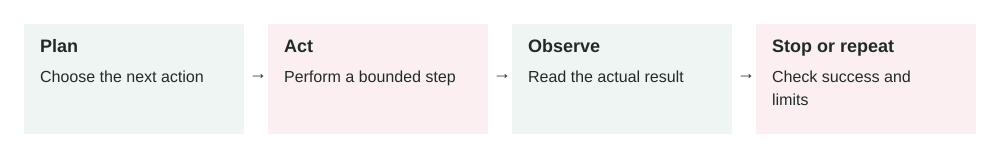

# Loop Engineering

2026-06-30 · Archived lesson · Original lesson text; technical claims not rechecked



Figure 6. Original study diagram added on 7 October 2026 to summarize this archived lesson. Each stage follows the previous stage; review may send the task back for correction.

## <a id="lesson-6-section-1"></a>1\. What It Means

**Loop engineering** means designing the repeated steps an AI agent follows to complete a task.

A simple chatbot usually works like this:

```text
User asks -> Model answers
```

An agent often works like this:

```text
User asks -> Model plans -> Tool runs -> Model observes result -> Model decides next step -> Repeat -> Final answer
```

That repeated cycle is the **loop**.

A loop usually has these parts:

-   **Goal:** what the agent is trying to finish
-   **State:** what the agent currently knows
-   **Planner:** decides the next step
-   **Action:** tool call, search, code execution, database query, etc.
-   **Observation:** result of the action
-   **Checker:** decides if the result is good enough
-   **Stop condition:** when the loop should end
-   **Fallback:** what to do if the loop fails

Simple meaning:

> Loop engineering is how you control an agent’s repeated thinking, acting, checking, and stopping.

This idea is related to agent research like ReAct, where language models combine reasoning and actions in an interleaved way. Source: [https://arxiv.org/abs/2210.03629](https://arxiv.org/abs/2210.03629)

* * *

## <a id="lesson-6-section-2"></a>2\. Why It Matters In Production Systems

Many AI failures happen because the loop is poorly designed.

Bad loop behavior can cause:

-   Infinite retries
-   Repeated wrong tool calls
-   High cost
-   Slow responses
-   Confident wrong answers
-   Tool spam
-   Weak final checks
-   No clear stopping point
-   Actions taken without enough evidence

In production, you need predictable control.

A good loop helps the agent:

-   Break complex tasks into steps
-   Use tools when needed
-   Learn from tool results
-   Stop when done
-   Ask for help when blocked
-   Avoid wasting tokens and money
-   Avoid unsafe actions

The key production idea:

> Do not let the model “just keep going.” Design the loop like real software.

* * *

## <a id="lesson-6-section-3"></a>3\. How It Works Step By Step

Example user request:

> “Find why checkout is failing and suggest a fix.”

A simple agent loop may work like this:

1.  **Set the goal**

    ```text
    Goal: Diagnose checkout failure and propose a fix.
    ```

2.  **Collect initial context**

    The agent reads the error message, logs, or failing test.

3.  **Plan the next action**

    Example:

    ```text
    Next step: Search logs for checkout errors.
    ```

4.  **Take action**

    The agent calls a tool:

    ```json
    {
      "tool": "search_logs",
      "input": {
        "query": "checkout error"
      }
    }
    ```

5.  **Observe the result**

    Tool returns:

    ```text
    Payment API rejected request: missing customer_email.
    ```

6.  **Update state**

    The agent now knows the likely failure is in the payment payload.

7.  **Plan another action**

    ```text
    Next step: Inspect payment payload code.
    ```

8.  **Check progress**

    The checker asks:

    -   Do we have enough evidence?
    -   Is the root cause clear?
    -   Do we need more data?
    -   Is there a safe fix?
9.  **Stop or continue**

    If enough evidence exists, stop.

    If not, continue the loop.

10.  **Produce final answer**


```text
Root cause: checkout payload does not send customer_email.
Suggested fix: map customer.primaryEmail to customer_email before calling payment API.
Verification: add a regression test for payment payload creation.
```

A loop is not just repeated model calls. It is controlled progress.

* * *

## <a id="lesson-6-section-4"></a>4\. How To Apply It In A Project

Start by designing the loop before writing prompts.

A practical loop design:

```text
1. Understand request
2. Decide if tools are needed
3. Use one tool at a time
4. Read result
5. Decide next step
6. Check if task is complete
7. Stop, ask user, or escalate
```

For production, define these rules clearly:

**Max iterations**

Example:

```text
The agent can take at most 5 tool steps.
```

This prevents endless loops.

**Tool budget**

Example:

```text
The agent can call expensive search APIs at most 2 times.
```

This controls cost.

**Stop condition**

Example:

```text
Stop when root cause is supported by logs and code evidence.
```

This prevents unnecessary extra work.

**Failure condition**

Example:

```text
If the agent cannot find evidence after 5 steps, explain what is missing.
```

This avoids fake certainty.

**Human handoff**

Example:

```text
If the action changes billing, asks for legal advice, or deletes data, stop and ask for approval.
```

This protects the business.

A useful loop config might look like this:

```json
{
  "max_steps": 5,
  "allowed_tools": ["search_logs", "read_file", "run_tests"],
  "stop_when": "root cause has evidence and fix is identified",
  "ask_user_when": "required input is missing or action is high risk",
  "forbidden_actions": ["deploy_to_production", "delete_customer_data"]
}
```

* * *

## <a id="lesson-6-section-5"></a>5\. Real-World Example 1: Coding Agent Debug Loop

**Use case:** A developer asks an AI coding agent to fix a failing test.

**User input:**

> “Fix the failing checkout test.”

**Poor loop:**

The agent immediately edits code based on a guess.

Bad outcome:

-   It may fix the symptom, not the cause.
-   It may break another test.
-   It may change unrelated files.

**Better loop:**

1.  Run the failing test.
2.  Read the exact error.
3.  Inspect the smallest related code area.
4.  Make a narrow fix.
5.  Run the failing test again.
6.  Run nearby tests.
7.  Stop and report what changed.

**Example observation:**

```text
Expected payment.customer_email to equal user.email.
Received undefined.
```

**Agent action:**

It checks the user model and finds:

```text
email was renamed to primaryEmail.
```

**Outcome:**

The agent changes only the payment payload mapping.

Final answer:

> “The checkout test failed because the payment payload still used `user.email`. I updated it to use `user.primaryEmail` and verified the checkout test passes.”

The loop made the fix evidence-based.

* * *

## <a id="lesson-6-section-6"></a>6\. Real-World Example 2: Research Assistant Loop

**Use case:** A business user asks an AI assistant to compare three CRM tools.

**User input:**

> “Compare HubSpot, Salesforce, and Pipedrive for a 20-person sales team.”

**Poor loop:**

The model answers from memory.

Bad outcome:

-   Pricing may be outdated.
-   Features may be wrong.
-   Important constraints may be missing.

**Better loop:**

1.  Clarify key requirements if missing.
2.  Search official pricing pages.
3.  Search official feature pages.
4.  Extract comparison points.
5.  Check if sources are recent.
6.  Summarize trade-offs.
7.  Recommend based on team size and needs.

**Example tool observations:**

```json
{
  "HubSpot": {
    "strength": "easy setup and marketing integration",
    "risk": "cost can rise with contacts and advanced features"
  },
  "Salesforce": {
    "strength": "high customization",
    "risk": "heavier admin and implementation effort"
  },
  "Pipedrive": {
    "strength": "simple sales pipeline management",
    "risk": "less enterprise customization"
  }
}
```

**Outcome:**

The final answer is grounded in current sources and practical trade-offs.

The loop prevents a confident but stale answer.

* * *

## <a id="lesson-6-section-7"></a>7\. Common Mistakes, Risks, And Trade-Offs

**Mistake 1: No max step limit**

The agent keeps trying.

This increases cost and latency.

Fix:

```text
Set max_steps.
```

**Mistake 2: Weak stop condition**

Bad:

```text
Stop when the agent feels done.
```

Better:

```text
Stop when the answer has evidence from logs, code, or source documents.
```

**Mistake 3: Too much planning, not enough action**

Some agents spend many steps planning but do not inspect real evidence.

Fix:

```text
Force early evidence collection.
```

**Mistake 4: Too much action, not enough checking**

Some agents call tools repeatedly without asking whether the task is complete.

Fix:

```text
Add a checker step after each observation.
```

**Mistake 5: No failure path**

If the agent cannot solve the task, it may invent an answer.

Fix:

```text
Define when to say “I do not have enough information.”
```

**Mistake 6: Same loop for every task**

A support refund agent and a coding agent should not use the same loop.

Different tasks need different loops.

**Trade-off: Quality vs speed**

More loop steps can improve quality.

But more steps also increase:

-   Latency
-   Cost
-   Complexity
-   Failure points

Production systems should use the smallest loop that solves the task reliably.

* * *

## <a id="lesson-6-section-8"></a>8\. Practical Best Practices

1.  **Design the loop before the prompt**

    Decide the workflow first. Then write prompts that support it.

2.  **Use small loops**

    A 3-step loop is easier to debug than a 15-step loop.

3.  **Set hard limits**

    Use limits for:

    -   Max steps
    -   Max tool calls
    -   Max time
    -   Max cost
    -   Max retries
4.  **Separate planner and checker roles**

    The planner asks:

    > “What should I do next?”

    The checker asks:

    > “Is this enough to finish safely?”

5.  **Log each loop step**

    For observability, record:

    -   Step number
    -   Decision
    -   Tool call
    -   Tool result
    -   Stop reason
6.  **Prefer evidence-based stopping**

    Stop because the task has enough evidence, not because the model sounds confident.

7.  **Add escalation rules**

    Stop and ask a human when:

    -   Permission is missing
    -   Data conflicts
    -   Action is high-risk
    -   The agent reaches max steps
    -   The task is ambiguous
8.  **Evaluate the loop, not only the final answer**

    Check:

    -   Did it choose the right tools?
    -   Did it stop too early?
    -   Did it waste steps?
    -   Did it ask for clarification at the right time?
    -   Did it avoid unsafe actions?

* * *

## <a id="lesson-6-section-9"></a>9\. Small Practice Exercise

Imagine you are building an AI agent that helps investigate failed deployments.

A user asks:

> “Why did the production deploy fail?”

Design the loop.

Answer these:

1.  What is the goal?
2.  What tools should the agent use?
3.  What should the first action be?
4.  What is the max step limit?
5.  What evidence is required before giving a root cause?
6.  When should the agent stop and ask a human?

A strong answer should include:

-   Read deployment logs first
-   Check recent commit or workflow change
-   Inspect failing command output
-   Avoid guessing from memory
-   Stop after a small number of evidence-gathering steps
-   Escalate if credentials, production access, or missing logs block diagnosis
