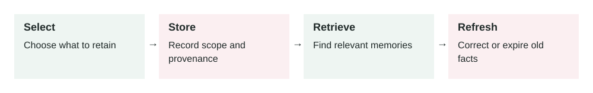

# Memory In AI Agents

2026-07-01 · Archived lesson · Original lesson text; technical claims not rechecked



Figure 7. Original study diagram added on 7 October 2026 to summarize this archived lesson. Each stage follows the previous stage; review may send the task back for correction.

## <a id="lesson-7-section-1"></a>1\. What It Means

**Memory** in an AI agent means the system can keep useful information beyond one single message.

A normal chat model only sees what is inside its current context window.

A **context window** is the amount of text the model can read at one time.

Memory lets the agent remember things such as:

-   User preferences
-   Past decisions
-   Project facts
-   Repeated instructions
-   Previous mistakes
-   Useful summaries
-   Long-running task state
-   Important business rules

Simple meaning:

> Memory helps an AI agent carry useful knowledge from the past into future work.

Memory can exist in different forms:

**Short-term memory**

Information used during the current task.

Example:

```text
The user asked to compare three vendors.
The user cares most about cost and implementation time.
```

**Long-term memory**

Information saved across sessions.

Example:

```text
The user prefers simple English and production-ready advice.
```

**Task memory**

Information about a specific workflow.

Example:

```text
Deployment failed because Node version was wrong last time.
Check .nvmrc before debugging deploy issues.
```

**User memory**

Information about user preferences.

Example:

```text
The user wants concise answers and dislikes vague theory.
```

**Project memory**

Information about a codebase, product, or business.

Example:

```text
The backend service runs on port 3000.
The frontend service runs on port 3002.
```

Memory is an active research area. A useful primary source is the MemGPT paper, which discusses managing memory beyond a model’s limited context window: [https://arxiv.org/abs/2310.08560](https://arxiv.org/abs/2310.08560)

* * *

## <a id="lesson-7-section-2"></a>2\. Why It Matters In Production Systems

Without memory, an AI agent can feel forgetful.

The user must repeat the same information again and again.

That creates problems:

-   Slower workflows
-   Repeated mistakes
-   Poor personalization
-   Weak long-running task handling
-   More tokens wasted on repeated context
-   Inconsistent behavior across sessions

In production, memory helps agents become more useful.

For example:

-   A coding agent remembers repo-specific commands.
-   A support agent remembers customer preferences.
-   A learning agent avoids repeating recent lessons.
-   A sales assistant remembers account history.
-   A project manager agent remembers open decisions.

But memory also creates risk.

If memory is wrong, private, outdated, or overused, the agent can make bad decisions.

The key production idea:

> Memory should be useful, controlled, reviewable, and safe.

Do not treat memory as magic. Treat it like a database that needs rules.

* * *

## <a id="lesson-7-section-3"></a>3\. How It Works Step By Step

A typical memory system works like this:

1.  **User interacts with the agent**

    Example:

    > “For future lessons, explain concepts in detail with real-world examples.”

2.  **Agent detects possible memory**

    The system asks:

    -   Is this information useful later?
    -   Is it stable?
    -   Is it safe to store?
    -   Did the user clearly express a preference?
3.  **Memory is written**

    Example memory:

    ```json
    {
      "type": "user_preference",
      "content": "User prefers detailed lessons with real-world examples.",
      "created_at": "2026-07-01",
      "source": "user_instruction"
    }
    ```

4.  **Later request arrives**

    Example:

    > “Teach me a new GenAI concept.”

5.  **Relevant memories are retrieved**

    The system searches memory and finds:

    ```text
    User prefers detailed lessons.
    Avoid recent topics.
    Use simple English.
    ```

6.  **Memory is added to context**

    The agent uses the memory while answering.

7.  **Agent responds**

    The lesson becomes more detailed and avoids recent repeats.

8.  **Memory may be updated**

    If the user changes preference, old memory should be updated or replaced.


* * *

## <a id="lesson-7-section-4"></a>4\. How To Apply It In A Project

Start small. Do not store everything.

A practical memory design:

**Step 1: Decide what memory is allowed**

Good memory candidates:

-   Stable user preferences
-   Project-specific facts
-   Repeated workflow rules
-   Long-running task state
-   Important decisions

Bad memory candidates:

-   Passwords
-   API keys
-   Payment details
-   Private health data unless your system is designed for it
-   Temporary facts that will quickly become stale
-   Guesswork that the user did not confirm

**Step 2: Define memory types**

Example:

```json
{
  "types": [
    "user_preference",
    "project_fact",
    "workflow_rule",
    "decision",
    "task_state"
  ]
}
```

**Step 3: Store source and date**

Every memory should say where it came from.

Example:

```json
{
  "content": "Use npm run test:authorization for auth verification.",
  "source": "deployment-debug-session",
  "created_at": "2026-06-20"
}
```

**Step 4: Retrieve only relevant memory**

Do not load all memories every time.

If the user asks about deployment, retrieve deployment memories.

If the user asks about lessons, retrieve teaching preferences.

**Step 5: Add freshness rules**

Some memories expire.

Example:

```text
Pricing memory expires after 30 days.
Deployment command memory should be verified if older than 90 days.
User writing preference can remain until changed.
```

**Step 6: Let users correct memory**

Users should be able to say:

> “Forget that.” “Update this preference.” “That is no longer true.”

* * *

## <a id="lesson-7-section-5"></a>5\. Real-World Example 1: Coding Agent Memory

**Use case:** A developer uses an AI coding agent across many sessions.

**Without memory:**

The user repeatedly says:

> “Use the existing test command.” “Do not change unrelated files.” “The frontend API routes are in this folder.” “The deploy script is the source of truth.”

The agent wastes time rediscovering the same facts.

**With memory:**

The system stores:

```json
{
  "type": "project_fact",
  "content": "For this repo, deployment logic is controlled by scripts/deploy-main.sh.",
  "source": "previous deployment debugging session",
  "created_at": "2026-06-18"
}
```

Later, the user asks:

> “Why did deployment fail again?”

The agent retrieves the memory and starts in the right place.

**Better behavior:**

Instead of giving generic advice, it checks:

-   Deployment script
-   Node version
-   Package manager version
-   Migration step
-   PM2 process names
-   Logs from the real deploy path

**Outcome:**

The coding agent becomes faster and more repo-aware.

**Risk:**

If the deployment process changed yesterday, old memory may be stale.

**Production fix:**

Mark memory as “possibly stale” and verify important facts before acting.

* * *

## <a id="lesson-7-section-6"></a>6\. Real-World Example 2: Customer Support Agent Memory

**Use case:** A SaaS company has an AI assistant for customer success.

**Customer history:**

-   Customer uses the enterprise plan.
-   They prefer email updates, not phone calls.
-   They had a serious onboarding issue last month.
-   Their renewal is in August.

**User input:**

> “Draft a reply to Acme about their onboarding concern.”

**Without memory:**

The AI writes a generic response:

> “We are sorry for the inconvenience. Our team will help you.”

**With memory:**

The agent retrieves:

```json
{
  "customer": "Acme",
  "plan": "enterprise",
  "preferred_contact": "email",
  "recent_issue": "onboarding delay",
  "renewal_month": "August"
}
```

**Better output:**

> “Hi Acme team, thanks for raising this. We understand the onboarding delay affected your rollout timeline. I’ll send a written update by email today with the migration support plan, owner, and next milestones before your August renewal review.”

**Outcome:**

The reply is more relevant and more useful.

**Risk:**

Customer memory may include sensitive information.

**Production fix:**

Use access control. Only authorized employees should access account memory.

* * *

## <a id="lesson-7-section-7"></a>7\. Common Mistakes, Risks, And Trade-Offs

**Mistake 1: Saving everything**

More memory is not always better.

Too much memory creates noise.

The agent may retrieve irrelevant or outdated information.

**Mistake 2: Saving unverified guesses**

Bad memory:

```text
User probably prefers short answers.
```

Better memory:

```text
User said: “Keep answers concise and practical.”
```

Memory should come from evidence.

**Mistake 3: No expiration**

Some facts become outdated.

Examples:

-   Pricing
-   API behavior
-   Team members
-   Server config
-   Legal rules
-   Product features

Use freshness rules.

**Mistake 4: Mixing private data with general memory**

Do not store sensitive data casually.

Memory needs the same security care as a database.

**Mistake 5: Memory silently changes behavior**

Users should understand when memory affects important output.

For high-impact domains, the system should show or explain important assumptions.

**Trade-off: Personalization vs privacy**

More memory improves personalization.

But it also increases privacy and security risk.

Production systems must choose carefully what to store.

* * *

## <a id="lesson-7-section-8"></a>8\. Practical Best Practices

1.  **Store only useful, stable information**

    Ask:

    > “Will this still help later?”

2.  **Store memory with metadata**

    Include:

    -   Type
    -   Source
    -   Date
    -   Owner
    -   Confidence
    -   Expiry, if needed
3.  **Separate memory types**

    Keep user preferences, project facts, and task state separate.

4.  **Retrieve selectively**

    Do not load all memories into every prompt.

5.  **Verify high-risk memory**

    If memory affects money, security, legal, medical, or production systems, verify it first.

6.  **Allow correction and deletion**

    Users should control their memory.

7.  **Avoid sensitive secrets**

    Never store passwords, API keys, or private tokens as memory.

8.  **Log memory usage**

    Record which memories were used in important decisions.

9.  **Evaluate memory quality**

    Test:

    -   Did the agent retrieve the right memory?
    -   Did it ignore irrelevant memory?
    -   Did it handle stale memory safely?
    -   Did it avoid storing private data?

* * *

## <a id="lesson-7-section-9"></a>9\. Small Practice Exercise

Imagine you are building an AI project assistant for a software team.

The user says:

> “For this repo, always run `npm run test:authorization` before changing auth code.”

Answer these:

1.  Should this be stored as memory?
2.  What type of memory is it?
3.  What metadata should be saved?
4.  When should the agent retrieve it?
5.  When should the agent verify it instead of trusting it blindly?

A strong answer:

-   Yes, store it.
-   Type: `project_workflow_rule`
-   Source: direct user instruction
-   Retrieve it for auth-related code changes
-   Verify if package scripts changed or the memory is old
-   Do not apply it to unrelated repos
