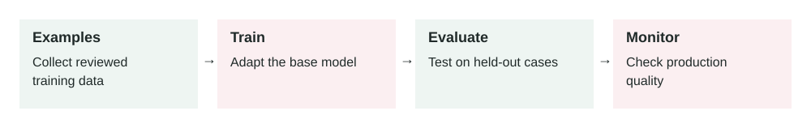

# Fine-Tuning

2026-07-02 · Archived lesson · Original lesson text; technical claims not rechecked



Figure 8. Original study diagram added on 7 October 2026 to summarize this archived lesson. Each stage follows the previous stage; review may send the task back for correction.

## <a id="lesson-8-section-1"></a>1\. What It Means

**Fine-tuning** means training an existing AI model further using your own examples.

You are not building a model from zero.

You start with a base model that already understands language, then teach it a specific pattern.

Example:

```text
Input: Customer message
Output: Correct support classification
```

If you give the model many high-quality examples, it can become better at that repeated task.

Simple meaning:

> Fine-tuning teaches a model to behave more like your examples.

Fine-tuning is useful when you want the model to consistently learn:

-   A specific output format
-   A classification style
-   A writing tone
-   Domain-specific labels
-   Repeated decision patterns
-   A narrow task with many examples

It is usually **not** the first thing to try.

Usually start with:

1.  Better prompt
2.  Better examples in the prompt
3.  Better retrieval or context
4.  Evaluation harness
5.  Fine-tuning only if the pattern is still not reliable

OpenAI’s model optimization docs describe fine-tuning as part of a wider loop with evals and prompting, not as a standalone magic fix: [https://platform.openai.com/docs/guides/fine-tuning](https://platform.openai.com/docs/guides/fine-tuning)

* * *

## <a id="lesson-8-section-2"></a>2\. Why It Matters In Production Systems

Fine-tuning matters when a production AI system needs consistent behavior at scale.

For example:

-   A support system must classify tickets into the same categories every time.
-   A legal assistant must produce summaries in a strict format.
-   A sales assistant must write in the company’s approved tone.
-   A moderation system must follow a custom policy.
-   A small model must perform a narrow task cheaply.

Fine-tuning can help with:

-   **Consistency:** fewer random format changes
-   **Lower prompt size:** fewer examples needed in every request
-   **Lower latency:** shorter prompts can be faster
-   **Lower cost:** smaller fine-tuned models may handle narrow tasks
-   **Better task fit:** model learns from many examples, not just a few

But it also adds operational cost.

You now need:

-   Training data
-   Data cleaning
-   Evaluation
-   Versioning
-   Monitoring
-   Rollback plan
-   Privacy review

Fine-tuning is production work, not just a model setting.

* * *

## <a id="lesson-8-section-3"></a>3\. How It Works Step By Step

A simple fine-tuning process looks like this:

1.  **Choose a narrow task**

    Example:

    > Classify customer support tickets into `billing`, `bug`, `feature_request`, or `account_access`.

2.  **Collect examples**

    Example training row:

    ```json
    {
      "input": "I was charged twice this month.",
      "output": "billing"
    }
    ```

3.  **Clean the dataset**

    Remove bad examples.

    Fix inconsistent labels.

    Example problem:

    ```text
    One person labels refund issues as "billing".
    Another person labels them as "payment".
    ```

    That will confuse the model.

4.  **Split data**

    Use one part for training and another part for testing.

    Example:

    -   80% training data
    -   20% test data
5.  **Train the model**

    The provider creates a fine-tuned model based on your examples.

6.  **Evaluate the model**

    Compare:

    -   Base model
    -   Prompt-only model
    -   Fine-tuned model

    Use real test cases.

7.  **Deploy carefully**

    Do not immediately send all traffic to the new model.

    Start with a small percentage.

8.  **Monitor production**

    Track:

    -   Accuracy
    -   Cost
    -   Latency
    -   Error rate
    -   User complaints
    -   Drift over time

* * *

## <a id="lesson-8-section-4"></a>4\. How To Apply It In A Project

Use this decision path.

First ask:

```text
Is the problem caused by missing knowledge?
```

If yes, use **RAG or context**, not fine-tuning.

Example:

> “What is our latest refund policy?”

Fine-tuning is bad for this because policies change.

Use retrieval from the policy database.

Next ask:

```text
Is the problem caused by inconsistent behavior?
```

If yes, fine-tuning may help.

Example:

> “Classify this ticket into exactly one of our 12 support categories.”

That is a repeated pattern.

Then ask:

```text
Do we have enough high-quality examples?
```

If no, do not fine-tune yet.

Improve prompts and collect examples first.

A practical project plan:

1.  Build a prompt-based version.
2.  Create an evaluation set.
3.  Measure baseline accuracy.
4.  Collect failed cases.
5.  Clean and label training examples.
6.  Fine-tune.
7.  Compare against baseline.
8.  Deploy only if it clearly improves the metric.

Success should be measured, not guessed.

* * *

## <a id="lesson-8-section-5"></a>5\. Real-World Example 1: Support Ticket Classification

**Use case:** A SaaS company receives thousands of support tickets.

They need each ticket classified into:

```text
billing
login_issue
bug_report
feature_request
cancellation
security
```

**Input:**

> “I cannot access my account after enabling two-factor authentication.”

**Expected output:**

```json
{
  "category": "login_issue",
  "priority": "medium"
}
```

**Prompt-only problem:**

The model sometimes outputs:

```json
{
  "category": "security",
  "priority": "high"
}
```

That may be understandable, but it does not match the company’s routing rules.

**Fine-tuning dataset:**

The team prepares examples:

```json
{
  "input": "I cannot access my account after enabling two-factor authentication.",
  "output": {
    "category": "login_issue",
    "priority": "medium"
  }
}
```

```json
{
  "input": "My invoice shows two charges for June.",
  "output": {
    "category": "billing",
    "priority": "medium"
  }
}
```

```json
{
  "input": "I found a way to see another user's data.",
  "output": {
    "category": "security",
    "priority": "critical"
  }
}
```

**Outcome:**

The fine-tuned model learns the company’s exact routing rules.

Support tickets go to the right team more often.

**Important guardrail:**

Security-related tickets should still be escalated by backend rules. Do not depend only on model classification.

* * *

## <a id="lesson-8-section-6"></a>6\. Real-World Example 2: Brand-Consistent Email Drafting

**Use case:** A company wants sales emails in a specific voice.

Their approved style:

-   Short paragraphs
-   Warm but not too casual
-   No hype
-   Clear next step
-   No fake urgency
-   No unsupported claims

**Input:**

```text
Customer: Acme Corp
Context: They asked about onboarding timeline.
Goal: Send follow-up email.
```

**Expected output:**

```text
Hi Sarah,

Thanks for discussing the onboarding timeline today.

Based on your August target, the next useful step is to confirm the migration owner, data sources, and legal review timeline.

I can send a short onboarding plan tomorrow with milestones and responsibilities.

Best,
Ali
```

**Prompt-only problem:**

The model sometimes writes:

```text
We are thrilled to revolutionize your workflow with our cutting-edge platform!
```

That does not match the brand.

**Fine-tuning approach:**

The team collects 1,000 approved sales emails.

Each example includes:

-   Customer context
-   Goal
-   Approved email

The fine-tuned model learns the company’s writing style.

**Outcome:**

Emails need less editing.

Sales reps save time.

**Important limitation:**

Fine-tuning should not teach current customer facts. Those should come from CRM or retrieval.

Fine-tuning teaches style and structure. It should not replace live data.

* * *

## <a id="lesson-8-section-7"></a>7\. Common Mistakes, Risks, And Trade-Offs

**Mistake 1: Fine-tuning to add knowledge**

Bad use:

> “Fine-tune the model on our latest pricing page.”

Pricing changes.

Use retrieval instead.

Fine-tuning is better for behavior, format, tone, and repeated decision patterns.

**Mistake 2: Training on messy examples**

If your examples are inconsistent, the model learns inconsistency.

Bad labels create bad behavior.

**Mistake 3: No evaluation set**

If you do not measure before and after, you do not know if fine-tuning helped.

**Mistake 4: Too broad a task**

Bad:

> “Fine-tune a model to be our whole company assistant.”

Better:

> “Fine-tune a model to classify support tickets into our approved categories.”

**Mistake 5: Ignoring privacy**

Training data may include customer names, emails, secrets, or sensitive business information.

Clean the data before training.

**Mistake 6: No rollback plan**

A fine-tuned model can be worse than the original model.

You need a way to return to the old version.

**Trade-off: Accuracy vs maintenance**

Fine-tuning can improve consistency.

But it creates a new asset to maintain.

When rules change, you may need new data and a new fine-tune.

* * *

## <a id="lesson-8-section-8"></a>8\. Practical Best Practices

1.  **Start with prompting and evals**

    Do not fine-tune before you know the baseline.

2.  **Use fine-tuning for repeated behavior**

    Good use cases:

    -   Classification
    -   Strict formatting
    -   Brand tone
    -   Domain-specific style
    -   Repeated structured extraction
3.  **Use RAG for changing knowledge**

    Policies, prices, product docs, and customer records should usually come from retrieval or tools.

4.  **Keep tasks narrow**

    One fine-tuned model should have a clear job.

5.  **Clean the data carefully**

    Remove duplicates, bad labels, private data, and contradictory examples.

6.  **Create a strong test set**

    Include:

    -   Normal cases
    -   Edge cases
    -   Hard cases
    -   Recently failed production cases
7.  **Compare against cheaper options**

    Sometimes a better prompt is enough.

    Sometimes a smaller fine-tuned model is cheaper at scale.

8.  **Version everything**

    Track:

    -   Dataset version
    -   Prompt version
    -   Model version
    -   Evaluation results
    -   Deployment date
9.  **Monitor after deployment**

    Fine-tuned models can still fail.

    Watch quality, cost, latency, and user feedback.


* * *

## <a id="lesson-8-section-9"></a>9\. Small Practice Exercise

Imagine you are building an AI assistant for a real estate company.

The assistant must classify incoming leads into:

```text
buyer
seller
renter
investor
not_relevant
```

A user message says:

> “I own a 3-bedroom apartment and want to know what price I can get if I list it next month.”

Answer these:

1.  Is fine-tuning useful for this task?
2.  What should one training example look like?
3.  What should not be stored in the training data?
4.  What metric would you use to decide if fine-tuning helped?
5.  Would you use fine-tuning, RAG, or both?

A strong answer:

-   Fine-tuning can help classify lead type.
-   The correct label is likely `seller`.
-   Private phone numbers and emails should be removed.
-   Measure classification accuracy on real leads.
-   Use fine-tuning for classification, but use RAG/tools for current market pricing.
