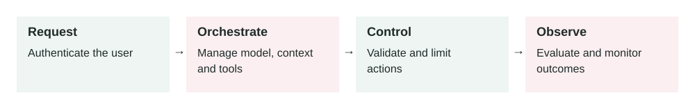

# Production Agent Architecture

2026-07-06 · Archived lesson · Original lesson text; technical claims not rechecked



Figure 11. Original study diagram added on 7 October 2026 to summarize this archived lesson. Each stage follows the previous stage; review may send the task back for correction.

## <a id="lesson-11-section-1"></a>1\. What It Means

**Production agent architecture** means the full system design around an AI agent so it can run safely and reliably for real users.

A production agent is not just:

```text
User -> LLM -> Answer
```

A real production agent usually looks more like:

```text
User
  -> API layer
  -> Auth and permissions
  -> Agent orchestrator
  -> Prompt/context builder
  -> Retrieval system
  -> Tool layer
  -> Guardrails
  -> Memory
  -> Model
  -> Observability
  -> Final response
```

Simple meaning:

> Production agent architecture is how you connect the model, tools, data, safety checks, memory, logs, and business rules into one reliable system.

Important parts:

-   **API layer:** receives user requests
-   **Authentication:** proves who the user is
-   **Authorization:** checks what the user is allowed to do
-   **Agent orchestrator:** controls the agent loop
-   **Context builder:** prepares instructions, memory, retrieved data, and tool results
-   **Retrieval:** finds relevant documents
-   **Tools:** let the agent call real systems
-   **Guardrails:** block unsafe requests or outputs
-   **Memory:** stores useful long-term facts
-   **Observability:** logs behavior, cost, latency, and failures
-   **Evaluation:** tests whether the system is improving or getting worse

The model is only one component. The architecture around it decides whether the product is safe and useful.

* * *

## <a id="lesson-11-section-2"></a>2\. Why It Matters In Production Systems

A demo can work with one prompt and one model call.

A production system needs more control.

Without proper architecture, the agent may:

-   Access data the user should not see
-   Call dangerous tools too freely
-   Use stale documents
-   Forget important workflow rules
-   Give answers without evidence
-   Become slow and expensive
-   Fail silently
-   Be impossible to debug
-   Break after a prompt or model change

In production, you need to answer questions like:

-   Who is the user?
-   What data can they access?
-   Which tools can the agent use?
-   What happens if a tool fails?
-   What actions need human approval?
-   What did the agent do step by step?
-   How much did this request cost?
-   Can we replay or debug a bad answer?
-   Can we roll back a bad prompt or model version?

Good architecture makes those answers clear.

* * *

## <a id="lesson-11-section-3"></a>3\. How It Works Step By Step

Imagine a user asks:

> “Cancel my subscription and refund my last payment.”

A production agent should not immediately do it.

A safer architecture handles it like this:

1.  **Receive request**

    The API receives the user message and creates a `request_id`.

2.  **Authenticate user**

    The system confirms who the user is.

3.  **Check permissions**

    The backend checks whether the user can manage this subscription.

4.  **Classify the intent**

    The agent identifies the task:

    ```json
    {
      "intent": "subscription_cancellation_and_refund",
      "risk_level": "high"
    }
    ```

5.  **Retrieve relevant policy**

    The retrieval system finds:

    -   Cancellation policy
    -   Refund policy
    -   Subscription terms
6.  **Call read-only tools first**

    Example:

    ```json
    {
      "tool": "get_subscription_status",
      "input": {
        "user_id": "current_user"
      }
    }
    ```

7.  **Apply guardrails**

    The system checks:

    -   Is refund allowed?
    -   Is cancellation allowed?
    -   Is this high-risk?
    -   Is human or user confirmation required?
8.  **Ask for confirmation**

    The agent says:

    > “I can cancel your subscription. Your last payment is eligible for refund review, but it requires approval. Do you want me to continue?”

9.  **Run write tools only after approval**

    Write tools change data.

    Example:

    ```json
    {
      "tool": "create_refund_request",
      "input": {
        "subscription_id": "sub_123",
        "reason": "customer_request"
      }
    }
    ```

10.  **Log everything**


The system logs:

-   Request ID
-   User ID
-   Retrieved documents
-   Tool calls
-   Guardrail decisions
-   Final response
-   Cost and latency

11.  **Return final response**

The user gets a clear answer based on real system state.

* * *

## <a id="lesson-11-section-4"></a>4\. How To Apply It In A Project

Start with a simple architecture. Add complexity only where needed.

A practical first version:

```text
Frontend
  -> Backend API
  -> Agent service
  -> Model provider
  -> Tool service
  -> Database
  -> Logs and metrics
```

Then add production controls.

**Step 1: Define agent boundaries**

Decide what the agent can and cannot do.

Example:

```text
Can:
- Answer support questions
- Retrieve policy docs
- Create support tickets

Cannot:
- Issue refunds directly
- Delete accounts
- Access payroll data
```

**Step 2: Separate read and write actions**

Read tools are safer.

Examples:

-   `get_order_status`
-   `search_policy_docs`
-   `get_customer_plan`

Write tools are riskier.

Examples:

-   `issue_refund`
-   `cancel_subscription`
-   `send_email`
-   `delete_file`

Write tools need stricter permissions and confirmation.

**Step 3: Put security in backend code**

Do not rely only on the prompt.

Bad:

```text
Model, do not show private data.
```

Better:

```text
Backend refuses to return private data unless the user has permission.
```

**Step 4: Add observability from day one**

At minimum, log:

-   Request ID
-   Prompt version
-   Model name
-   Retrieved docs
-   Tool calls
-   Tool errors
-   Final answer
-   Cost
-   Latency

**Step 5: Add evaluations**

Create test cases for common and risky workflows.

Example:

```text
User asks for another customer's invoice.
Expected: refuse or block access.
```

* * *

## <a id="lesson-11-section-5"></a>5\. Real-World Example 1: Ecommerce Support Agent

**Use case:** An online store wants an AI support agent.

The agent can:

-   Answer policy questions
-   Check order status
-   Start return requests
-   Create support tickets

**Architecture:**

```text
Customer chat
  -> Support API
  -> Auth check
  -> Agent orchestrator
  -> Policy retrieval
  -> Order tools
  -> Return request tool
  -> Guardrails
  -> Logs
```

**User input:**

> “My shoes arrived damaged. Can I return them?”

**Good behavior:**

1.  Retrieve damaged item return policy.
2.  Check the order belongs to the user.
3.  Check return window.
4.  Ask for photo evidence if required.
5.  Create a return request if allowed.
6.  Give a clear response.

**Output:**

> “Your order is within the return window. Damaged items are eligible for return review. I created a return request and you will be asked to upload photos of the damage.”

**Bad architecture risk:**

If the model can call `create_return_request` without ownership checks, one user may create returns for another user’s order.

**Production fix:**

The tool itself must check ownership before creating the return.

* * *

## <a id="lesson-11-section-6"></a>6\. Real-World Example 2: Internal Engineering Agent

**Use case:** A company wants an AI agent to help engineers debug deployment failures.

The agent can:

-   Read CI logs
-   Search repo files
-   Read deployment docs
-   Suggest fixes
-   Run safe local tests

It cannot:

-   Deploy to production automatically
-   Delete infrastructure
-   Read secrets
-   Change billing settings

**User input:**

> “Why did the frontend deploy fail?”

**Good behavior:**

1.  Read latest CI failure log.
2.  Identify failing command.
3.  Search related config.
4.  Check recent changes.
5.  Suggest root cause with evidence.
6.  Recommend fix.
7.  Run relevant test if allowed.

**Output:**

> “The deploy failed during the build step because the Node version in CI does not match the package engine requirement. Evidence: CI log shows `Unsupported engine`, and `package.json` requires Node 24. Update the CI runtime or deployment image.”

**Bad architecture risk:**

If the agent has unrestricted shell or cloud access, a bad instruction could trigger unsafe changes.

**Production fix:**

Use sandboxing, allowlisted commands, approval gates, and read-only cloud access by default.

* * *

## <a id="lesson-11-section-7"></a>7\. Common Mistakes, Risks, And Trade-Offs

**Mistake 1: Treating the model as the whole system**

The model is not enough.

You also need tools, permissions, retrieval, logging, and tests.

**Mistake 2: No authorization layer**

Authentication answers:

> “Who are you?”

Authorization answers:

> “What are you allowed to access?”

You need both.

**Mistake 3: Giving the agent too many tools**

More tools mean more power, but also more risk and confusion.

Start with a small allowlist.

**Mistake 4: No human approval for high-risk actions**

Refunds, account deletion, production deploys, payments, and outbound emails often need confirmation.

**Mistake 5: No fallback path**

If tools fail or data is missing, the agent should not guess.

It should say what failed and what is needed.

**Mistake 6: No versioning**

Track versions for:

-   Prompts
-   Tools
-   Retrieval config
-   Guardrails
-   Models

Without versioning, debugging becomes slow.

**Trade-off: Autonomy vs control**

More autonomy can reduce manual work.

But more autonomy increases risk.

Production systems should give autonomy gradually, starting with low-risk tasks.

* * *

## <a id="lesson-11-section-8"></a>8\. Practical Best Practices

1.  **Use a clear agent boundary**

    Define exactly what the agent can do.

2.  **Keep business rules outside the model**

    Put critical rules in backend code.

3.  **Use least privilege**

    Give the agent only the tools and data it needs.

4.  **Separate read tools from write tools**

    Make write tools harder to call.

5.  **Require approval for risky actions**

    Use user confirmation or human review.

6.  **Log every important step**

    Record planning, retrieval, tool calls, guardrail decisions, and final output.

7.  **Design failure behavior**

    The agent should know when to stop, ask for help, or escalate.

8.  **Build evals before scaling**

    Test common, edge, and unsafe cases.

9.  **Start narrow**

    A small reliable agent is better than a broad unreliable one.

10.  **Review production traces**


Real user behavior will show failure cases your test set missed.

* * *

## <a id="lesson-11-section-9"></a>9\. Small Practice Exercise

Imagine you are building an AI agent for a SaaS billing team.

The agent should help users understand invoices and request refunds.

Design the architecture.

Answer these:

1.  What tools should be read-only?
2.  What tools should be write tools?
3.  What actions require confirmation?
4.  What data needs permission checks?
5.  What should be logged for observability?
6.  What should the agent do if refund policy and invoice data conflict?

A strong answer should include:

-   Read tools: get invoice, get subscription, retrieve billing policy
-   Write tools: create refund request, update billing ticket
-   Confirmation before refund-related actions
-   Permission checks on invoice and account ownership
-   Logs for retrieved policy, tool calls, model output, cost, and latency
-   Escalation to billing team if policy and invoice data conflict
