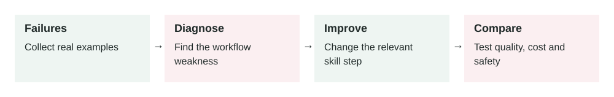

# Skill Optimization

2026-07-07 · Archived lesson · Original lesson text; technical claims not rechecked



Figure 12. Original study diagram added on 7 October 2026 to summarize this archived lesson. Each stage follows the previous stage; review may send the task back for correction.

## <a id="lesson-12-section-1"></a>1\. What It Means

**Skill optimization** means improving an AI agent skill so it works better, more safely, and more consistently over time.

An **agent skill** is a reusable workflow that tells an AI agent how to do a specific task.

Example:

```text
Skill: Review a pull request
Skill: Triage a support ticket
Skill: Diagnose a deployment failure
Skill: Summarize a sales call
```

Skill optimization is what you do after the first version exists.

Simple meaning:

> Skill optimization is the process of finding where an agent skill fails, then improving its instructions, tools, examples, checks, and limits.

You are not just “making the prompt better.”

You may improve:

-   Trigger rules
-   Workflow steps
-   Tool choices
-   Output format
-   Examples
-   Guardrails
-   Evaluation tests
-   Memory usage
-   Stop conditions
-   Error handling
-   Human approval rules

This is related to a broader idea in AI systems: optimizing language model pipelines against measurable outcomes instead of relying only on manual prompt trial and error. A useful research source is the DSPy paper: [https://arxiv.org/abs/2310.03714](https://arxiv.org/abs/2310.03714)

* * *

## <a id="lesson-12-section-2"></a>2\. Why It Matters In Production Systems

A skill may work well in simple demos but fail with real users.

Real users send messy requests.

They provide missing data, mixed goals, unclear language, private information, and edge cases.

Without optimization, an agent skill may:

-   Trigger at the wrong time
-   Use the wrong tool
-   Skip an important check
-   Return inconsistent output
-   Ask too many questions
-   Fail silently
-   Take unsafe actions
-   Cost too much
-   Produce answers that are hard to review

In production, the first version of a skill is rarely the final version.

A good team treats skills like software:

-   Version them
-   Test them
-   Monitor them
-   Improve them
-   Roll back bad changes

The key idea:

> A skill should improve from real failures, not from guesswork.

* * *

## <a id="lesson-12-section-3"></a>3\. How It Works Step By Step

Imagine you have a skill called:

```text
support-ticket-triage
```

Its job is to classify support tickets by category and priority.

Optimization may work like this:

1.  **Collect real failures**

    Example failure:

    ```text
    Ticket: "I can see another customer's invoice."
    Agent output: category = billing, priority = medium
    Correct output: category = security, priority = critical
    ```

2.  **Identify the failure type**

    Ask:

    -   Was the trigger wrong?
    -   Was the instruction unclear?
    -   Was an example missing?
    -   Was the tool result bad?
    -   Was the output format weak?
    -   Was a guardrail missing?
3.  **Improve the skill**

    Add a rule:

    ```text
    If the ticket mentions seeing another user's data, leaked data, account takeover, or credentials, classify as security and critical.
    ```

4.  **Add a test case**

    Add the failed ticket to the evaluation set.

5.  **Run old and new versions**

    Compare:

    -   Did the new version fix the failure?
    -   Did it break other cases?
    -   Did cost or latency increase?
6.  **Deploy gradually**

    Start with a small percentage of traffic or internal users.

7.  **Monitor results**

    Track:

    -   Accuracy
    -   Escalation rate
    -   Invalid output rate
    -   Tool failure rate
    -   Cost
    -   Latency
    -   Human correction rate
8.  **Repeat**

    Optimization is a loop.


* * *

## <a id="lesson-12-section-4"></a>4\. How To Apply It In A Project

Use a structured optimization process.

Start with one skill.

Example:

```text
Skill: refund-request-review
```

Then create a simple scorecard.

```text
Metric 1: Correct policy retrieval
Metric 2: Correct refund eligibility decision
Metric 3: No private data leak
Metric 4: Correct output format
Metric 5: Human approval requested when required
```

Then collect examples:

```json
{
  "input": "Customer wants refund for damaged item after opening package.",
  "expected": {
    "retrieve": ["damaged_item_policy"],
    "decision": "eligible_for_review",
    "approval_required": false
  }
}
```

Improve the skill only when you know what failed.

Common optimization levers:

**Improve trigger**

Bad:

```text
Use this skill for support.
```

Better:

```text
Use this skill when the user asks whether a customer refund should be approved, rejected, or escalated.
```

**Improve steps**

Add missing workflow steps.

Example:

```text
1. Check order ownership.
2. Retrieve refund policy.
3. Check return window.
4. Check product category.
5. Detect fraud risk.
6. Decide approval, rejection, or escalation.
```

**Improve examples**

Add edge cases.

Example:

```text
Opened item but damaged on arrival -> eligible for review.
Opened item with no damage -> maybe not eligible.
High-value refund -> manager approval required.
```

**Improve checks**

Add final validation.

Example:

```text
Before final answer, verify that the decision is supported by a policy and order data.
```

* * *

## <a id="lesson-12-section-5"></a>5\. Real-World Example 1: Pull Request Review Skill

**Use case:** A software team uses an AI agent to review pull requests.

**Initial skill behavior:**

The agent comments on style issues:

```text
Consider renaming this variable.
```

But it misses real risks:

-   Missing authorization check
-   Race condition
-   Payment double-submit bug
-   No test for a critical path

**Failure example:**

A PR changes this route:

```text
POST /admin/users/delete
```

The AI says:

```text
Looks good. Maybe rename deleteUser to removeUser.
```

But the route forgot to check whether the caller is an admin.

**Optimization:**

Update the skill:

```text
Review priority:
1. Security and authorization bugs
2. Data loss or payment risk
3. Behavioral regressions
4. Missing tests for changed behavior
5. Maintainability issues only if meaningful
```

Add a checklist:

```text
For every API route change, check authentication, authorization, input validation, and audit logging.
```

Add an evaluation case:

```text
Input: PR adds admin delete route without role check.
Expected finding: High severity authorization bug.
```

**Outcome:**

The skill now focuses on production risk, not cosmetic feedback.

* * *

## <a id="lesson-12-section-6"></a>6\. Real-World Example 2: Sales Call Summary Skill

**Use case:** A sales team uses an AI agent to summarize call transcripts.

**Initial skill behavior:**

The summary sounds nice but misses important CRM fields.

Example input:

```text
Customer wants migration done before September. Budget is approved. Legal review is the blocker. Sarah is final decision maker.
```

Bad output:

```text
The customer is interested and wants to continue the discussion.
```

This is too vague.

**Optimization:**

Update the skill output format:

```json
{
  "decision_maker": "...",
  "budget_status": "...",
  "timeline": "...",
  "main_pain_point": "...",
  "blocker": "...",
  "next_step": "...",
  "crm_risk": "low | medium | high"
}
```

Add rules:

```text
If legal review is mentioned, include it as a blocker.
If a timeline is mentioned, extract the date or month.
If budget is approved, do not say budget is unknown.
```

Add examples:

```json
{
  "input": "Budget is approved but legal is blocking.",
  "expected": {
    "budget_status": "approved",
    "blocker": "legal review"
  }
}
```

**Outcome:**

The skill produces structured CRM data that sales managers can search and report on.

* * *

## <a id="lesson-12-section-7"></a>7\. Common Mistakes, Risks, And Trade-Offs

**Mistake 1: Optimizing from one example only**

One failure matters, but do not overfit.

**Overfitting** means improving for one case while making general behavior worse.

Fix:

```text
Add the failed case to the test set, then run all important cases.
```

**Mistake 2: Making the skill too long**

Adding every rule can make the skill hard for the model to follow.

Fix:

-   Keep core workflow short
-   Move detailed policy to retrieval
-   Use examples for edge cases
-   Split broad skills into smaller skills

**Mistake 3: No measurable target**

Bad:

```text
Make it better.
```

Better:

```text
Reduce invalid JSON from 8% to below 1%.
Increase correct priority classification from 75% to 90%.
```

**Mistake 4: Ignoring tool failures**

Sometimes the skill is fine, but the tool is bad.

Example:

-   Search tool returns old policy
-   CRM tool misses latest notes
-   Calendar tool times out

Do not fix the prompt when the tool is the problem.

**Mistake 5: Optimizing only for accuracy**

Production also cares about:

-   Cost
-   Latency
-   Safety
-   User trust
-   Maintainability

**Trade-off: More rules vs more flexibility**

More rules can improve consistency.

But too many rules can make the agent rigid or confused.

A good skill is clear enough to guide behavior but not so crowded that it becomes hard to follow.

* * *

## <a id="lesson-12-section-8"></a>8\. Practical Best Practices

1.  **Keep a failure log**

    Store real failures with:

    -   Input
    -   Actual output
    -   Expected output
    -   Failure type
    -   Root cause
    -   Fix
2.  **Group failures by pattern**

    Example groups:

    -   Wrong trigger
    -   Missing rule
    -   Bad retrieval
    -   Tool failure
    -   Unsafe action
    -   Wrong output format
3.  **Use evals before changing production**

    Every skill improvement should be tested.

4.  **Version skills**

    Example:

    ```text
    refund-review-v1
    refund-review-v2
    refund-review-v3
    ```

5.  **Prefer small changes**

    Change one thing at a time when possible.

6.  **Add examples for edge cases**

    Especially for cases the model keeps missing.

7.  **Measure cost and latency**

    A better skill that is 4x slower may not be acceptable.

8.  **Separate policy from workflow**

    The skill should say how to work.

    Retrieval or tools should provide current policy.

9.  **Add final self-checks**

    Example:

    ```text
    Before final answer, confirm the output follows the required schema and any risky action has approval.
    ```

10.  **Review with domain experts**


For legal, finance, medical, security, or compliance workflows, expert review is required.

* * *

## <a id="lesson-12-section-9"></a>9\. Small Practice Exercise

Imagine you have a skill called:

```text
deployment-failure-diagnosis
```

It often gives generic answers like:

```text
Check the logs and try again.
```

But you want specific root-cause analysis.

Answer these:

1.  What failure pattern do you see?
2.  What new workflow steps would you add?
3.  What evidence should be required before final answer?
4.  What test case would you add?
5.  What metric would show improvement?

A strong answer should include:

-   Failure pattern: vague diagnosis without evidence
-   Add steps: read exact error, inspect recent changes, check config, identify failing command
-   Require evidence: log line, changed file, or failing command output
-   Add test: CI log with known Node version mismatch
-   Metric: percentage of answers with correct root cause and evidence reference
