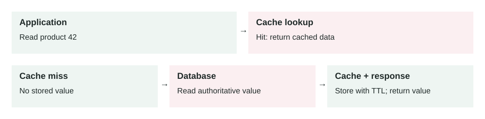

Lesson 0001 · Caching

# Cache-Aside

Two read paths. A hit avoids a database read; a miss reads the database and fills the cache. Updates need an invalidation or freshness policy.

Reduce repeated database work while keeping the database as the source of truth.

## The concept

The application checks a cache before reading the database. On a cache miss, it reads the database and stores the result in the cache for later requests.

request → cache → miss → database → update cache → response

## When to use it

-   Many requests repeatedly read the same data.
-   Database reads are slow or expensive.
-   Slightly stale data is acceptable for a limited time.

## Real-world example

An online store caches product details for five minutes. Popular products are served from Redis, reducing database load. The database remains authoritative.

## Trade-offs

-   **Benefit:** lower latency and database load.
-   **Cost:** more infrastructure and invalidation logic.
-   **Risk:** users may briefly receive stale data.
-   **Failure mode:** a cache outage can suddenly overload the database.

## Common mistakes

-   Caching sensitive data without proper isolation or encryption.
-   Using one expiration time for data with different freshness needs.
-   Not preventing a cache stampede when a popular key expires.
-   Treating the cache as durable storage.

## Think today

Your product page gets 10,000 reads per minute but changes twice per day. What would you cache, for how long, and how would you invalidate it after an update?

## Primary source

Read: [Microsoft Azure Architecture Center: Cache-Aside Pattern](https://learn.microsoft.com/en-us/azure/architecture/patterns/cache-aside) .

Ask a follow-up question if any part of the pattern is unclear.
