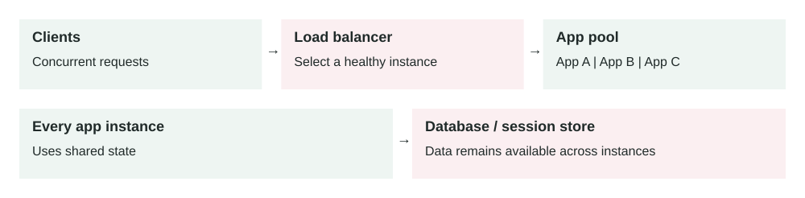

Lesson 0002 · Scalability

# Horizontal Scaling

Add application instances to share traffic. Local-only sessions break when a user's next request reaches a different instance; shared storage can still become the bottleneck.

Handle more traffic by adding application instances instead of making one machine larger.

## The concept

Horizontal scaling, or scaling out, runs multiple instances of the same service. A load balancer distributes requests across healthy instances.

clients → load balancer → app 1 / app 2 / app 3

## When to use it

-   Traffic can exceed the capacity of one machine.
-   The service needs higher availability.
-   Demand changes enough to benefit from automatic scaling.

## Real-world example

A ticketing API normally runs three instances. Before a major sale, it automatically grows to twenty instances, then scales back after demand falls.

## Important requirement

Application instances should be stateless. Store sessions, uploaded files, and shared state in external systems such as Redis, object storage, or a database. Any healthy instance must be able to handle the next request.

## Trade-offs

-   **Benefit:** more capacity and better fault tolerance.
-   **Cost:** load balancing, monitoring, and deployment become more complex.
-   **Limit:** the database may become the next bottleneck.
-   **Risk:** scaling too slowly can still cause overload during sudden spikes.

## Common mistakes

-   Keeping user sessions only in instance memory.
-   Scaling on CPU alone without watching latency or queue depth.
-   Stopping instances before active requests finish.
-   Adding servers without load testing downstream dependencies.

## Think today

Your API grows from two instances to ten, but latency stays high. Which shared dependency would you inspect first, and what metric would confirm the bottleneck?

## Connect yesterday

[Cache-aside](0001-cache-aside.md) can reduce database pressure after application servers scale out, but it does not remove database limits.

## Primary source

Read: [AWS: What is Amazon EC2 Auto Scaling?](https://docs.aws.amazon.com/autoscaling/ec2/userguide/what-is-amazon-ec2-auto-scaling.html) .

Ask a follow-up question if any part of the pattern is unclear.
