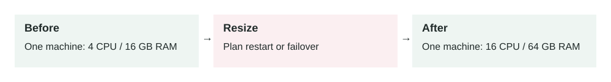

Lesson 0003 · Scalability

# Vertical Scaling

The same machine role gets more resources. This helps a measured CPU or memory limit, but a larger single machine still needs a separate availability plan.

Increase the CPU, memory, storage performance, or network capacity of one machine instead of adding more machines.

## The problem it solves

A service can become slow because its current machine has insufficient resources. CPU may remain near 100%, memory pressure may cause swapping, or storage may be unable to handle enough operations per second. Vertical scaling, also called **scaling up**, moves the workload to a larger machine.

4 CPU / 16 GB RAM → 16 CPU / 64 GB RAM

## How it works

1.  Measure which resource is limiting the workload.
2.  Select a machine with more of that specific resource.
3.  Back up data and prepare a rollback plan.
4.  Stop, resize, and restart the machine when required.
5.  Run health checks and compare performance with the baseline.

The application architecture usually stays unchanged. This makes vertical scaling operationally simpler than distributing work across multiple nodes. However, the larger machine remains one failure domain.

## Main components

-   **Compute:** more CPU cores or faster processors.
-   **Memory:** more RAM for working data, connections, and caches.
-   **Storage:** more capacity, IOPS, or throughput.
-   **Network:** higher bandwidth and packet-processing limits.
-   **Monitoring:** evidence that identifies the real bottleneck.

## Example 1: growing database

A PostgreSQL database serves a business application. Its active dataset grows from 10 GB to 80 GB, and frequently used indexes no longer fit in memory. Disk reads increase and query latency rises from 30 ms to 300 ms.

Moving from 16 GB to 128 GB of RAM allows the database to retain more indexes and frequently accessed pages in memory. This can be the simplest correct solution while the workload still fits comfortably on one database server.

## Example 2: production resize under load

A payment API runs on one 4-vCPU VM and receives 200 requests per second. During payroll processing it reaches 95% CPU, p95 latency grows from 150 ms to 2 seconds, and requests begin timing out.

The team temporarily moves it to a 16-vCPU VM. Before resizing, they drain traffic, take a snapshot, confirm driver and storage compatibility, reserve a maintenance window, and prepare the old machine type as rollback. The resize restores capacity quickly, but the team then removes the single point of failure by moving toward multiple stateless instances.

## When to use it

-   You need a fast capacity increase with minimal architectural change.
-   The application cannot easily distribute work across multiple nodes.
-   A database requires strong coordination and still fits on one machine.
-   The larger machine is affordable and comfortably handles future growth.

## When not to rely on it

-   The service requires high availability across failure domains.
-   Traffic changes rapidly and frequently.
-   The workload is approaching the provider's largest machine size.
-   The bottleneck is inefficient code, slow queries, locks, or an external API.

## Implementation and reliability

-   Use CPU, memory, disk latency, IOPS, network, and application latency metrics.
-   Load test the new size; additional CPU does not fix every bottleneck.
-   Plan downtime because some platforms require stopping the machine.
-   Verify instance type, architecture, drivers, disks, and network compatibility.
-   Take tested backups and define exact rollback conditions.
-   Run post-change health checks before restoring full traffic.

## Security considerations

-   Preserve encryption, firewall, identity, and audit settings during replacement.
-   Do not expose a temporary public address while testing the larger machine.
-   Protect snapshots because they may contain production data and credentials.
-   Use infrastructure as code to reduce configuration drift during resizing.

## Performance and cost

Vertical scaling can improve performance immediately, but cost often increases in large steps. A machine with four times the memory may cost roughly four times as much even when memory was not the real bottleneck. Larger machines can also increase the financial and operational impact of a single failure.

## Key trade-offs

-   **Simplicity vs resilience:** one larger node is simpler but less fault tolerant.
-   **Speed vs limits:** resizing is fast, but every platform has a maximum size.
-   **Low engineering effort vs higher unit cost:** architecture stays simple, but large machines can be expensive.
-   **Consistency vs availability:** one database avoids distributed coordination, but maintenance can cause downtime.

## Common mistakes and edge cases

-   Resizing before identifying whether CPU, memory, disk, or code is the constraint.
-   Assuming more CPU will fix lock contention or sequential processing.
-   Ignoring downtime, IP address changes, or machine compatibility.
-   Scaling up repeatedly without defining the point to redesign or scale out.
-   Increasing database connections with machine size until downstream systems fail.
-   Forgetting that a larger machine can take longer to restart, restore, or replace.

## Connection to previous lessons

[Horizontal scaling](0002-horizontal-scaling.md) adds machines and improves fault tolerance, but requires stateless services and coordination. Vertical scaling changes fewer things and is often the right first move. [Cache-aside](0001-cache-aside.md) may delay either type of scaling by reducing repeated database work.

## Design exercise

A PostgreSQL server has 90% memory usage, 20% CPU usage, low disk latency, and a 99.9% availability requirement. Queries slow down only after the active dataset exceeds memory. Would you scale vertically, horizontally, add caching, or combine approaches? Describe the metrics, migration steps, rollback trigger, and remaining single-point-of-failure risk.

## Primary source

Read: [AWS: Change the instance type for an EC2 instance](https://docs.aws.amazon.com/AWSEC2/latest/UserGuide/change-instance-type-of-ebs-backed-instance.html) .

Ask a follow-up question if any part of the design is unclear.
