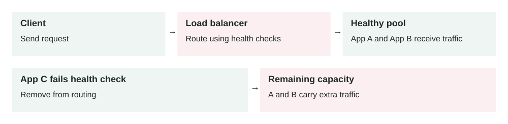

Lesson 0004 · Reliability

# Load Balancing

Health checks change which servers are eligible for traffic. Removing a failed server protects requests only if the remaining servers have enough capacity.

A load balancer receives client requests and sends each request to one of several healthy backend servers.

## The problem it solves

When an application runs on one server, that server can become overloaded or fail completely. After you add more servers with [horizontal scaling](0002-horizontal-scaling.md), clients need one stable place to send traffic. A load balancer gives clients one endpoint while spreading work across many servers.

Clients → DNS → Load balancer → Healthy app servers → Database / cache

## How it works

1.  A client calls one public hostname, such as api.example.com.
2.  DNS points that hostname to the load balancer.
3.  The load balancer accepts the connection or HTTP request.
4.  It checks its list of healthy backend servers.
5.  It chooses a backend using a routing rule or balancing algorithm.
6.  The backend handles the request and returns the response.

The client usually does not know which server handled the request. This is useful because servers can be added, removed, deployed, or replaced without changing the client.

## Main components

-   **Listener:** the port and protocol the load balancer accepts, such as HTTPS on port 443.
-   **Backend pool:** the servers, containers, or IP targets that can receive traffic.
-   **Health check:** a repeated test that decides whether a backend should receive traffic.
-   **Routing rule:** logic that sends traffic by host, path, header, port, or service.
-   **Algorithm:** the method used to choose a backend, such as round robin or least connections.
-   **TLS termination:** the load balancer decrypts HTTPS before sending traffic to backends.

## Example 1: web API with four servers

A simple order API runs on four identical app servers. The load balancer receives 800 requests per second and sends roughly 200 requests per second to each server. If the team deploys a new version, it can remove one server from rotation, update it, run health checks, and then put it back.

This only works cleanly if the app servers are mostly stateless. User sessions, carts, and temporary data should live in a shared store such as Redis or a database, not only in one server's memory.

## Example 2: production failure during peak traffic

An e-commerce checkout service runs across six containers in three availability zones. During a sale, traffic reaches 3,000 requests per second. One container starts returning HTTP 500 errors because it lost its database connection.

The load balancer health check calls `/health` every 10 seconds. After two failed checks, the bad container is marked unhealthy and receives no new requests. Existing requests may still fail, but the blast radius is limited. The remaining five containers continue serving traffic while the orchestrator replaces the broken container.

## When to use it

-   You have multiple app servers, containers, or service instances.
-   You need one stable public endpoint for a service.
-   You want to remove unhealthy instances automatically.
-   You want rolling deployments without sending users to broken versions.
-   You need traffic routing by path, hostname, region, or service.

## When not to use it

-   A small internal tool runs fine on one machine and downtime is acceptable.
-   The backend is not safe to run on multiple instances.
-   The real bottleneck is the database, a lock, or a slow third-party API.
-   You need global disaster recovery; one regional load balancer is not enough.

## Implementation considerations

-   Make app servers stateless or move session state to a shared store.
-   Use health checks that prove real readiness, not only process existence.
-   Set timeouts lower than client timeouts so failures return quickly.
-   Enable connection draining before removing a backend during deploys.
-   Pass request IDs and original client IP headers to preserve observability.
-   Test behavior when one backend, one zone, or one dependency fails.

## Security considerations

-   Terminate TLS at the load balancer or re-encrypt traffic to private backends.
-   Keep backend servers private; only the load balancer should reach them directly.
-   Attach WAF, rate limiting, and DDoS protection at the public edge when needed.
-   Restrict admin and health-check endpoints so they do not expose sensitive data.
-   Validate forwarded headers; do not blindly trust client-supplied IP headers.

## Reliability concerns

-   Run the load balancer across multiple availability zones when possible.
-   Keep enough spare backend capacity to survive one instance or zone failure.
-   Use slow-start or warm-up so new instances do not receive full load immediately.
-   Monitor unhealthy target count, target latency, 4xx/5xx rates, and rejected connections.
-   Decide what happens if all backends are unhealthy: fail closed, serve maintenance, or route to fallback.

## Performance and cost

Load balancing improves throughput by using many servers, but it adds one network hop. Usually that cost is small compared with the reliability gain. Managed load balancers also add direct cost based on time, traffic, rules, or capacity units. The bigger cost risk is over-scaling backends because health checks or routing rules hide an inefficient application.

## Key trade-offs

-   **Simplicity vs resilience:** one server is simpler, but multiple servers behind a load balancer survive failures better.
-   **Stateless design vs convenience:** shared session storage is more work, but it avoids users being tied to one server.
-   **Strict health checks vs false failures:** deep checks catch real issues, but can remove healthy servers if dependencies briefly fail.
-   **TLS termination vs end-to-end encryption:** terminating TLS simplifies certificates and inspection, but backends may still need encryption.

## Common mistakes and edge cases

-   Using a health check that returns OK even when the app cannot reach the database.
-   Using sticky sessions to hide unsafe stateful server design.
-   Forgetting connection draining, causing user requests to fail during deploys.
-   Setting timeouts too high, which keeps broken requests open and wastes capacity.
-   Ignoring uneven traffic when some requests are much slower than others.
-   Allowing direct public access to backend servers, bypassing the load balancer.
-   Not planning for all targets becoming unhealthy at the same time.

## Connection to previous lessons

[Horizontal scaling](0002-horizontal-scaling.md) creates the need for load balancing. [Vertical scaling](0003-vertical-scaling.md) can buy time before adding more servers, but it does not remove the single server failure risk. [Cache-aside](0001-cache-aside.md) can reduce backend pressure so the load balancer and app servers handle fewer expensive database reads.

## Design exercise

You run an API on three servers behind a load balancer. One server becomes slow but still returns HTTP 200 from `/health`. p95 latency doubles during peak traffic. What should your health check measure, what timeout values would you review, and how would you deploy a fix without dropping active user requests?

## Primary source

Read: [AWS: What is Elastic Load Balancing?](https://docs.aws.amazon.com/elasticloadbalancing/latest/userguide/what-is-load-balancing.html) .

Ask a follow-up question if any part of the design is unclear.
