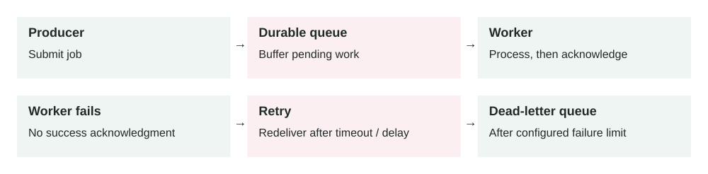

Lesson 0005 · Asynchronous Systems

# Message Queues

Success removes work from the queue. A failure can lead to redelivery, so processing must tolerate duplicates. The retry path needs limits and an owner for dead-letter messages.

A message queue stores work temporarily so producers and workers do not need to be online, fast, or scaled at exactly the same time.

## The problem it solves

Some work should not happen inside the user's request. Sending emails, resizing images, charging retries, report generation, fraud checks, and webhooks can be slow or unreliable. If the API waits for all of that work, users see slow responses and failures spread across the system.

A queue creates a buffer. The API records the work as a message, returns quickly, and background workers process the message later.

API / producer → Queue → Worker pool → Database / external service

## How it works

1.  A producer creates a message that describes work to do.
2.  The queue stores the message durably.
3.  A worker receives the message when it has capacity.
4.  The worker processes the job.
5.  If processing succeeds, the worker acknowledges or deletes the message.
6.  If processing fails, the message becomes available again or moves to a dead-letter queue.

The key idea is decoupling. Producers care about submitting work. Workers care about completing work. The queue sits between them and absorbs spikes, retries, and temporary failures.

## Main components

-   **Producer:** the service that sends work to the queue.
-   **Message:** a small payload with the task type, IDs, metadata, and retry context.
-   **Queue:** the durable buffer that stores messages until workers are ready.
-   **Consumer / worker:** the process that receives and handles messages.
-   **Visibility timeout:** the time a message is hidden while one worker processes it.
-   **Dead-letter queue:** a separate queue for messages that fail too many times.

## Example 1: image processing

A marketplace lets sellers upload product images. The upload API stores the original file, sends an `ImageUploaded` message, and returns success to the seller. Workers later create thumbnails, compress the image, scan it, and update the product record.

Without a queue, upload requests would wait for CPU-heavy image processing. With a queue, sellers get a fast response and workers can scale separately when many sellers upload at the same time.

## Example 2: production spike and external failure

A SaaS billing system receives 50,000 invoice events in 10 minutes at the end of the month. Each invoice must call a payment provider and send an email. The payment provider starts timing out for 20% of requests.

The API writes invoice messages to a queue and returns quickly. Workers process 300 messages per second under normal conditions. When the provider is slow, the queue depth grows, but the API stays healthy. Failed messages retry with delay. After five failures, a message moves to a dead-letter queue so engineers can inspect it without blocking all other invoices.

## When to use it

-   Work can happen after the user gets a response.
-   Traffic arrives in bursts but processing capacity is limited.
-   An external dependency is slow, rate-limited, or temporarily unreliable.
-   You need retries without making the original request wait.
-   Different services need a stable handoff point.

## When not to use it

-   The user needs the final result immediately before continuing.
-   The task must be strongly consistent with the request transaction.
-   The team has no monitoring or ownership for failed background jobs.
-   Ordering is strict and the queue design does not guarantee the order you need.
-   The work is tiny and synchronous processing is simpler and reliable enough.

## Implementation considerations

-   Keep messages small; store large files in object storage and send a pointer.
-   Make workers idempotent because a message may be delivered more than once.
-   Choose retry limits, backoff, and dead-letter queue behavior deliberately.
-   Set visibility timeout longer than normal processing time, but not extremely long.
-   Track queue depth, oldest message age, processing rate, failure rate, and DLQ count.
-   Use a stable message schema and version it when producers and consumers change.

## Security considerations

-   Encrypt queue data at rest and in transit.
-   Give producers only permission to send messages and workers only permission to consume.
-   Do not put passwords, API keys, or raw sensitive data in message bodies.
-   Validate message payloads; never trust queue input just because it is internal.
-   Protect dead-letter queues because failed messages may contain production context.

## Reliability concerns

-   Plan for duplicate messages with idempotency keys or processed-event records.
-   Plan for poison messages that fail every retry and fill the queue.
-   Use alarms on oldest message age, not only queue size.
-   Apply backpressure when producers create work faster than workers can finish it.
-   Have a safe replay process for messages in the dead-letter queue.

## Performance and cost

Queues improve user-facing latency because the API stops waiting for slow work. They also smooth traffic spikes, so worker capacity can be sized for sustained throughput instead of the highest instant spike. The cost is extra infrastructure, more monitoring, and possible delayed completion. If workers fall behind for too long, the system is not failing loudly, but users may still experience stale data or missing side effects.

## Key trade-offs

-   **Fast response vs delayed result:** the request returns quickly, but the work finishes later.
-   **Loose coupling vs debugging complexity:** services fail less together, but traces cross async boundaries.
-   **Retries vs duplicates:** retrying improves reliability, but workers must handle repeated messages safely.
-   **Buffering vs hidden backlog:** queues absorb spikes, but a growing queue can hide a capacity problem.

## Common mistakes and edge cases

-   Putting business-critical work in a queue without alerts for failed jobs.
-   Assuming queues guarantee exactly-once processing in all conditions.
-   Using message order as a hidden dependency when multiple workers run in parallel.
-   Retrying immediately and overwhelming an already failing dependency.
-   Making messages too large or tightly coupled to one database schema.
-   Forgetting that background work still needs authorization and audit logs.

## Connection to previous lessons

[Load balancing](0004-load-balancing.md) spreads live request traffic across healthy servers. Queues spread background work across workers and protect the request path from slow tasks. [Horizontal scaling](0002-horizontal-scaling.md) also applies to workers: add more consumers when the queue is growing. [Cache-aside](0001-cache-aside.md) reduces repeated reads, while queues reduce synchronous work.

## Design exercise

A signup API sends welcome emails, creates a CRM record, and calls a fraud service. Today the API takes 4 seconds and fails whenever the CRM is down. Which parts would you move to a queue, what would the message contain, how would you make retries safe, and what alerts would prove the queue is healthy?

## Primary source

Read: [AWS: What is Amazon Simple Queue Service?](https://docs.aws.amazon.com/AWSSimpleQueueService/latest/SQSDeveloperGuide/welcome.html) . For failed-message handling, also review [AWS: Using dead-letter queues in Amazon SQS](https://docs.aws.amazon.com/AWSSimpleQueueService/latest/SQSDeveloperGuide/sqs-dead-letter-queues.html) .

Ask a follow-up question if any part of the design is unclear.
