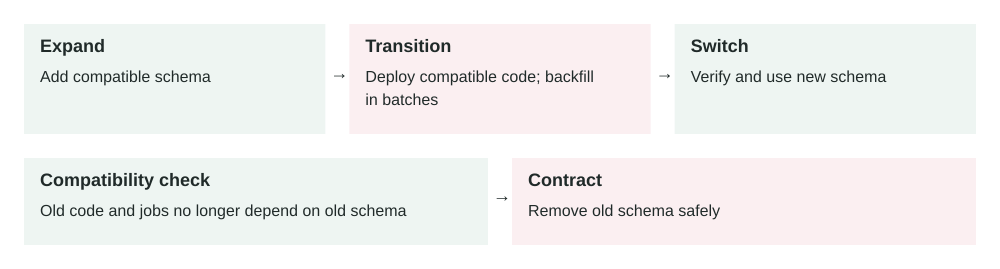

Lesson 0006 · Databases

# Zero-Downtime Database Migrations

Schema removal comes last. The compatibility window lets old and new application versions coexist while the backfill runs. Verify the cutover before deleting old data.

A zero-downtime migration changes a production database in small compatible steps so old code, new code, and live traffic can safely overlap.

## The problem it solves

Database schema changes can break running applications. If you rename a column while old app servers still read the old name, requests fail. If you add a slow index on a large table, writes may block. If you backfill millions of rows in one transaction, the database can become overloaded.

Zero-downtime migration design prevents one release from assuming the entire system changes at the same instant. In real production, old app instances, new app instances, background jobs, and database migrations may all overlap.

Expand schema → Deploy compatible code → Backfill safely → Switch reads/writes → Contract old schema

## How it works

1.  **Expand:** add the new table, column, index, or nullable field without removing the old path.
2.  **Dual support:** deploy code that can work with both old and new schema shapes.
3.  **Backfill:** copy or calculate existing data in small batches.
4.  **Switch:** move reads and writes to the new schema after data is ready.
5.  **Contract:** remove the old column, table, or code only after it is no longer used.

This is often called the expand-and-contract pattern. It turns one risky migration into several safe releases. The cost is more steps, but each step is reversible or easier to pause.

## Main components

-   **Schema migration:** the database change, such as adding a column or index.
-   **Application compatibility:** code that supports both old and new schema versions.
-   **Backfill job:** a controlled process that updates old rows in batches.
-   **Feature flag:** a switch that lets you move traffic gradually to the new path.
-   **Rollback plan:** the exact action to stop, pause, or reverse a bad migration.
-   **Observability:** metrics, logs, and checks that prove the migration is safe.

## Example 1: adding a user display name

A social app wants to add `display_name` to the `users` table. A safe first step is to add the nullable column. Then the application writes both `name` and `display_name` for new updates. A batch job fills `display_name` for existing users. After the team verifies that every active row has the new value, reads switch to the new column. The old column is removed in a later release.

The important part is compatibility. During deployment, some servers may still use the old column and some may use the new code. Both must work.

## Example 2: production migration on a large table

An orders table has 400 million rows and receives 6,000 writes per second during peak traffic. The team needs to add an index for faster customer order history queries. A normal blocking index build could slow writes or lock the table long enough to cause an incident.

The production-safe approach is to use the database's online or concurrent index creation mode, run it during a low-risk period, and monitor replication lag, write latency, CPU, disk I/O, and lock waits. If pressure rises above the rollback threshold, the team cancels or pauses the operation. The query path is enabled only after the index is valid and performance is measured.

## When to use it

-   Your application has real users and cannot pause for schema changes.
-   Multiple app versions may run at the same time during deploys.
-   The table is large enough that backfills, indexes, or constraints may take time.
-   You are renaming, dropping, moving, or changing the meaning of data.
-   You need a safe rollback if the new code or data path fails.

## When not to use it

-   A tiny internal app can accept a clear maintenance window.
-   The database is disposable or can be recreated from source data.
-   The change is purely additive and has no performance or compatibility risk.
-   The extra release steps create more risk than a planned short downtime.

## Implementation considerations

-   Prefer additive changes first: add before rename, remove, or make required.
-   Make new columns nullable first, then enforce `NOT NULL` after backfill and validation.
-   Backfill in small batches with sleeps or rate limits between batches.
-   Use online index creation when your database supports it.
-   Keep old and new code paths compatible across at least one deploy window.
-   Check background workers and queued jobs; they may run old code after the web deploy.
-   Write migration scripts so they can be safely retried after partial failure.

## Security considerations

-   Do not expose sensitive copied data through a new column before permissions are updated.
-   Preserve encryption, masking, retention, and audit rules when moving data.
-   Limit who can run production migrations, especially destructive changes.
-   Avoid logging raw row values while debugging migration failures.
-   Test rollback without restoring production data into unsafe environments.

## Reliability concerns

-   Define stop conditions before starting: max lock time, lag, error rate, or latency.
-   Monitor old and new code paths until the old path is fully removed.
-   Protect the database from aggressive backfills that compete with user traffic.
-   Plan for partial progress; a migration may succeed for 60% of rows and then fail.
-   Keep backups, but do not treat restore-from-backup as your normal rollback plan.

## Performance and cost

Safe migrations often take longer because they use batching, online operations, and multiple releases. That is usually better than causing downtime. The cost is extra engineering effort, temporary duplicate writes, storage for old and new columns, and monitoring time. The performance risk is database pressure: locks, replication lag, large transactions, slow indexes, and cache churn.

## Key trade-offs

-   **Speed vs safety:** one big migration is faster to write, but harder to recover from.
-   **Simplicity vs compatibility:** supporting old and new schema shapes adds temporary code.
-   **Immediate cleanup vs rollback:** deleting old columns quickly reduces clutter but removes fallback options.
-   **Strong constraints vs rollout flexibility:** constraints protect data but should be added after data is ready.

## Common mistakes and edge cases

-   Renaming or dropping a column in the same release where code stops using it.
-   Adding a required column without a safe default or backfill plan.
-   Running a large backfill in one transaction.
-   Forgetting that background workers, cron jobs, and old containers may still use the old schema.
-   Using rollback code that assumes the migration fully completed.
-   Adding an index safely but enabling a query before the index is ready.
-   Testing only on a tiny local database where lock and backfill behavior is unrealistic.

## Connection to previous lessons

[Message queues](0005-message-queues.md) are often used for safe backfills because workers can process rows gradually. [Load balancing](0004-load-balancing.md) means old and new app servers may run at the same time, so migrations must support mixed versions. [Cache-aside](0001-cache-aside.md) can hide database load, but cached data may also need invalidation when the schema or data shape changes.

## Design exercise

You need to rename `users.full_name` to `users.display_name` on a table with 80 million rows and continuous traffic. Design the releases: what do you add first, when do you dual-write, how do you backfill, when do you switch reads, and what metrics decide whether to pause or roll back?

## Primary source

Read: [GitLab Docs: Avoiding downtime in migrations](https://docs.gitlab.com/development/database/avoiding_downtime_in_migrations/) .

Ask a follow-up question if any part of the design is unclear.
