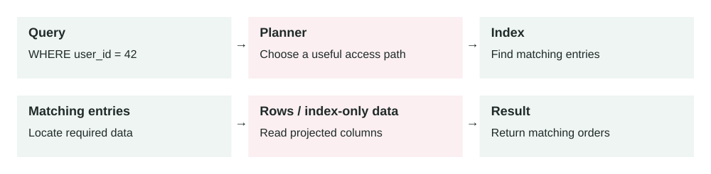

Lesson 0007 · Databases

# Database Indexes

An index can reduce how much data a query reads. The planner may still prefer a scan; some queries can use index-only scans. Writes also need to maintain the index.

A database index is a separate data structure that helps the database find matching rows faster without scanning the whole table.

## The problem it solves

As tables grow, simple queries can become slow. A query that was fast on 10,000 rows may become painful on 100 million rows. Without a useful index, the database may need to check many rows to find a small result set.

Indexes solve lookup problems. They help queries filter, join, sort, and enforce uniqueness efficiently. But they are not free: every index takes storage and must be updated when rows are inserted, updated, or deleted.

Query → Planner chooses index → Index lookup → Matching row IDs → Table rows → Result

## How it works

1.  You create an index on one or more columns used by important queries.
2.  The database keeps a sorted or searchable structure beside the table.
3.  When a query runs, the query planner estimates whether the index is useful.
4.  If useful, the database reads a smaller part of the index instead of scanning the full table.
5.  The database fetches matching rows and returns the result.

The planner can still ignore an index. For example, if a query returns most of the table, scanning the table may be cheaper than jumping through the index and then reading many table pages anyway.

## Main components

-   **Indexed columns:** the fields used for filtering, joining, sorting, or uniqueness.
-   **Index type:** the structure, such as B-tree, hash, GIN, GiST, or BRIN.
-   **Query planner:** the database component that decides whether to use the index.
-   **Selectivity:** how much the index narrows the result set.
-   **Statistics:** database metadata that helps the planner estimate cost.
-   **Maintenance cost:** extra work on writes because the index must stay updated.

## Example 1: finding a user's orders

An `orders` table has 20 million rows. The app often runs: `WHERE user_id = ? ORDER BY created_at DESC LIMIT 20`. Without a helpful index, the database may scan many orders, filter by user, sort them, and return the latest 20.

A compound index on `(user_id, created_at DESC)` matches the query shape. The database can jump to that user's orders in the correct order and stop after 20 rows. This is usually much faster than scanning and sorting.

## Example 2: production incident from missing index

A support dashboard filters tickets by `account_id` and `status = 'open'`. At launch, each account has a few hundred tickets. Six months later, enterprise accounts have millions. During business hours, dashboard traffic reaches 1,200 requests per minute and the query starts doing repeated full table scans.

CPU rises to 95%, read I/O spikes, and unrelated APIs slow down because they share the same database. The fix is not just "add an index quickly." The team creates an index safely, ideally using an online or concurrent method, verifies the query plan, and adds monitoring for slow queries. A partial index on open tickets may be better than indexing every historical closed ticket.

## When to use it

-   A frequent query filters by a column and returns a small part of the table.
-   A query needs sorted results quickly, especially with `LIMIT`.
-   A join repeatedly uses the same foreign key or lookup column.
-   You need to enforce uniqueness, such as one email per user.
-   A production slow-query log shows the same expensive query pattern repeatedly.

## When not to use it

-   The table is tiny and scans are already cheap.
-   The query returns a large percentage of the table.
-   The column has very low selectivity, such as a boolean used alone.
-   The table is write-heavy and the index is rarely used.
-   You are guessing without checking query plans or real workload data.

## Implementation considerations

-   Design indexes around real query shapes, not individual columns in isolation.
-   Use `EXPLAIN` or your database's query plan tool before and after changes.
-   Keep column order intentional in compound indexes; equality filters often come before range and sort columns.
-   Consider partial indexes for common filtered subsets, such as active or unprocessed rows.
-   Remove unused duplicate indexes after proving they are not needed.
-   Create large production indexes with a zero-downtime migration approach.

## Security considerations

-   Indexes may duplicate sensitive values, so database encryption and access controls still matter.
-   Unique indexes can reveal data existence through error messages if the app exposes them poorly.
-   Expression indexes on normalized data, such as lowercased emails, should follow the same privacy rules as source columns.
-   Slow unindexed queries can become a denial-of-service risk if attackers can trigger expensive filters.
-   Do not give application users direct access to index metadata if it reveals sensitive schema details.

## Reliability concerns

-   Creating an index on a large table can consume CPU, I/O, locks, and replication bandwidth.
-   Bad indexes can make writes slower and increase database recovery time.
-   Stale statistics can cause the planner to choose the wrong plan.
-   Adding many indexes can hide query problems until write throughput collapses.
-   Index bloat may grow over time and require maintenance depending on the database.

## Performance and cost

A good index can turn a slow query into a fast lookup. It can reduce CPU, disk reads, memory pressure, and response time. The cost is storage, slower writes, more backup size, more replication work, and more operational care. Indexes are performance tools, but they are also capacity and cost decisions.

## Key trade-offs

-   **Read speed vs write speed:** indexes make reads faster but inserts and updates heavier.
-   **Specificity vs flexibility:** a targeted compound index is fast for one query shape but may not help others.
-   **Storage cost vs latency:** more indexes use more disk but can reduce expensive scans.
-   **Fast fix vs safe rollout:** adding an index may fix latency, but production creation still needs migration discipline.

## Common mistakes and edge cases

-   Creating one index per column without matching the actual query.
-   Expecting an index to help when the query returns most rows.
-   Putting compound index columns in the wrong order.
-   Indexing a column but wrapping it in a function that prevents normal index use.
-   Forgetting that indexes must be maintained during every write.
-   Adding an index locally on tiny data and assuming production behavior will match.
-   Not checking whether an old index became unused after the product changed.

## Connection to previous lessons

[Zero-downtime migrations](0006-zero-downtime-database-migrations.md) matter because large indexes must be added safely. [Cache-aside](0001-cache-aside.md) can reduce repeated database reads, but a cache should not hide permanently bad query design. [Vertical scaling](0003-vertical-scaling.md) may buy time for a slow database, but the correct index can remove the real bottleneck. [Message queues](0005-message-queues.md) can help process index-related backfills or cleanup work gradually.

## Design exercise

A table `events` has 200 million rows. The main query is `WHERE account_id = ? AND event_type = ? AND created_at > ? ORDER BY created_at DESC LIMIT 100`. What index would you try first, how would you verify the query plan, and what production metrics would you watch while creating the index?

## Primary source

Read: [PostgreSQL Docs: Indexes](https://www.postgresql.org/docs/current/indexes.html) .

Ask a follow-up question if any part of the design is unclear.
