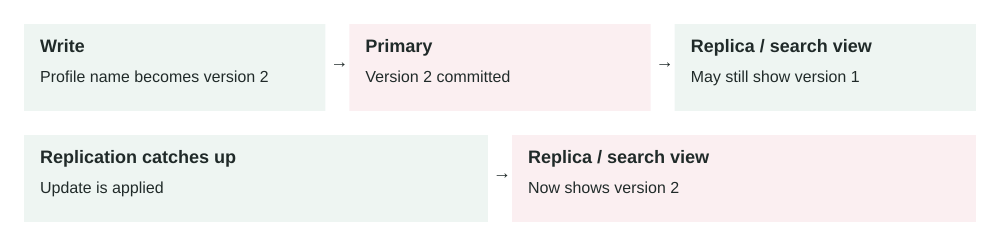

Lesson 0008 · Consistency

# Eventual Consistency

Different readers can temporarily see different versions. Convergence depends on updates reaching and being applied by the replica or derived view. A lagging permission view can create a security risk.

Eventual consistency means different copies of data may disagree briefly, but they should converge to the same value after writes stop and replication finishes.

## The problem it solves

Distributed systems often keep data in more than one place: replicas, caches, search indexes, queues, analytics stores, or different regions. Updating every copy immediately can be slow, expensive, or unavailable when part of the system is down.

Eventual consistency accepts temporary staleness so the system can stay fast and available. The trade-off is that users or services may briefly read old data after a successful write.

Write accepted → Primary data updated → Replication / async update → Other readers catch up

## How it works

1.  A service accepts a write and stores it in the primary system.
2.  The system sends updates to replicas, caches, indexes, or other regions.
3.  Some reads may hit a copy that has not received the update yet.
4.  Background replication continues until copies catch up.
5.  After enough time, later reads return the new value from all healthy copies.

Eventual consistency is not the same as random inconsistency. A production system still needs clear rules: how long staleness is acceptable, how conflicts are resolved, how retries work, and which operations require stronger guarantees.

## Main components

-   **Primary write path:** the place where the write is accepted first.
-   **Replicas or derived stores:** copies such as read replicas, caches, search indexes, or regional tables.
-   **Replication mechanism:** the process that moves changes from one place to another.
-   **Lag:** the delay between the accepted write and all readers seeing it.
-   **Conflict resolution:** the rule used when two updates disagree.
-   **Read policy:** the decision of when stale reads are acceptable and when strong reads are required.

## Example 1: profile update and search

A user updates their profile name from "Hamza K." to "Hamza Khan." The main user table updates immediately. A background job later updates the search index used by people search.

For a short time, the profile page may show the new name while search results still show the old name. That is usually acceptable if search catches up quickly. It would not be acceptable if the old value contained sensitive data that must disappear immediately.

## Example 2: production multi-region reads

A global e-commerce app runs in the US, Europe, and Asia. Users can update shipping addresses. Writes are accepted in the nearest region and replicated to other regions, usually within one second. During a regional network issue, replication lag grows to 45 seconds.

Product browsing and recommendation reads can tolerate stale data, so they keep using local replicas. Checkout cannot risk shipping to an old address, so it reads from a stronger source or asks the user to confirm the address. The design uses eventual consistency for speed, but switches to stronger consistency for business-critical decisions.

## When to use it

-   Reads need to be fast and highly available across replicas or regions.
-   Temporary stale data is acceptable for the user experience.
-   The data is derived, such as search results, feeds, counters, recommendations, or analytics.
-   The system needs to keep working during partial network or replica failures.
-   You can explain and measure the allowed staleness window.

## When not to use it

-   Money movement, inventory reservation, permissions, or safety decisions require the latest value.
-   A stale read can leak private data or violate compliance rules.
-   The user expects read-your-writes behavior immediately after editing something.
-   Conflicts cannot be resolved safely or automatically.
-   The team has no visibility into replication lag or failed updates.

## Implementation considerations

-   Classify operations: which can be stale, which need read-your-writes, and which need strong consistency.
-   Expose clear UI states, such as "processing" or "syncing", when users may see delayed results.
-   Use version numbers, timestamps, or event IDs to detect old updates arriving late.
-   Make update handlers idempotent so duplicate replication events do not corrupt data.
-   Measure replication lag and alert when it exceeds the business tolerance.
-   Use stronger reads for critical paths instead of forcing every read to be strong.

## Security considerations

-   Do not serve stale authorization or permission data for sensitive operations.
-   When deleting private data, make sure caches, indexes, logs, and replicas are also cleaned up.
-   Avoid exposing old personal data in search indexes after a user updates or removes it.
-   Protect replication channels because they carry production changes across systems.
-   Audit conflict resolution rules when they affect money, access, or compliance data.

## Reliability concerns

-   Replication can pause, fall behind, or replay events out of order.
-   Retries can create duplicate events unless consumers are idempotent.
-   Conflicting writes from different regions may need deterministic resolution.
-   Derived stores can drift silently unless you run reconciliation checks.
-   Failover can expose older data if the replacement replica is behind.

## Performance and cost

Eventual consistency can reduce latency because reads can use nearby replicas, caches, or indexes. It can also reduce cost because not every read needs the strongest and most expensive path. The cost is design complexity: monitoring lag, handling conflicts, explaining stale UI states, and deciding which paths need stronger guarantees.

## Key trade-offs

-   **Speed vs freshness:** local or cached reads are faster but may return old data.
-   **Availability vs strict correctness:** the system can keep serving during partial failures, but some reads may lag.
-   **Lower cost vs more logic:** weaker reads can cost less, but the application must handle stale values.
-   **Async updates vs simpler reasoning:** background propagation scales well, but debugging becomes harder.

## Common mistakes and edge cases

-   Saying "eventual consistency" without defining how much delay is acceptable.
-   Using stale permission data for authorization decisions.
-   Assuming users will not notice after they update data and immediately read it back.
-   Letting cache, search, and database copies drift with no reconciliation job.
-   Resolving conflicts by timestamp without thinking about clock skew or business meaning.
-   Retrying failed replication forever without a dead-letter path or alert.
-   Using eventual consistency for inventory or balance checks that need strict correctness.

## Connection to previous lessons

[Cache-aside](0001-cache-aside.md) is often eventually consistent because cached values can be stale. [Message queues](0005-message-queues.md) create async workflows where side effects finish later. [Zero-downtime migrations](0006-zero-downtime-database-migrations.md) may temporarily support old and new data shapes at the same time. [Database indexes](0007-database-indexes.md) and search indexes can also lag or require safe rebuilds in production.

## Design exercise

You are designing a shopping cart used across mobile and web. Item additions must feel instant, but checkout must never charge for the wrong quantity. Which reads can be eventually consistent, which reads must be strong, how would you handle conflicts, and what lag metric would you alert on?

## Primary source

Read: [AWS DynamoDB Docs: Read consistency](https://docs.aws.amazon.com/amazondynamodb/latest/developerguide/HowItWorks.ReadConsistency.html) .

Ask a follow-up question if any part of the design is unclear.
