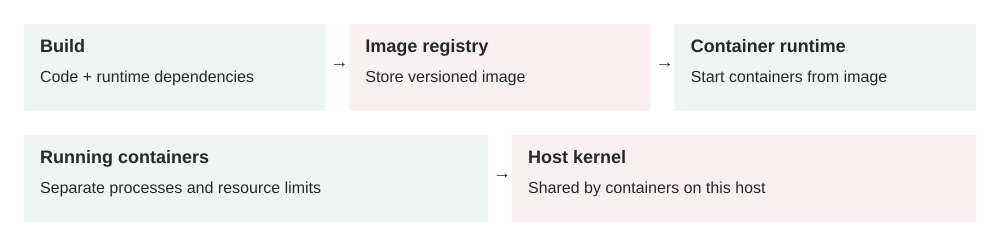

Lesson 0009 · Deployment

# Containerization

A versioned image travels between environments. Containers provide process isolation while sharing the host kernel; persistent data and secrets need separate handling.

Containerization packages an application with the runtime, libraries, and configuration it needs, then runs it as an isolated process.

## The problem it solves

Applications often fail because environments are different. A service may work on a developer laptop but fail in staging because Node, Python, system packages, environment variables, or OS libraries are different.

Containers reduce this drift. The team builds one image and runs that same image in local development, CI, staging, and production. This makes deploys more repeatable and scaling more predictable.

Source code → Container image → Registry → Container runtime → Running container

## How it works

1.  Write a container build file that describes the app runtime and files.
2.  Build an immutable image from the source code and dependencies.
3.  Push the image to a registry.
4.  Deploy the image to a server, container platform, or orchestrator.
5.  The runtime starts one or more isolated containers from the image.
6.  Traffic reaches the container through a published port or service route.

A container is not a full virtual machine. It usually shares the host kernel but has isolated process, filesystem, network, and resource boundaries. This makes containers lighter than VMs, while still giving useful separation.

## Main components

-   **Image:** a versioned package containing the app and its dependencies.
-   **Container:** a running process created from an image.
-   **Containerfile / Dockerfile:** the recipe used to build the image.
-   **Registry:** a place to store and pull images, such as Docker Hub or a private registry.
-   **Runtime:** the engine that starts, stops, and isolates containers.
-   **Orchestrator:** a system, such as Kubernetes or ECS, that schedules and replaces containers at scale.

## Example 1: consistent API deployments

A Node.js API needs Node 22, a specific image library, and a few system packages. Without containers, every server must be configured correctly by scripts or manual setup. One missing library can break production.

With containers, the team builds one API image. CI tests that image, staging runs that image, and production deploys that same image tag. If a rollback is needed, the platform starts the previous image tag instead of rebuilding the server by hand.

## Example 2: production scaling and failed container

A payment worker runs as 20 containers across five machines. Each container processes messages from a queue. During peak load, the queue grows from 5,000 to 80,000 messages, so the platform scales the worker to 80 containers.

One machine runs out of memory and kills several containers. The orchestrator detects failed containers, starts replacements on healthier machines, and the queue continues draining. The container image made scaling simple, but the system still needed memory limits, health checks, logs, metrics, and safe retry behavior.

## When to use it

-   You want the same app package across local, CI, staging, and production.
-   You run many services with different runtimes or dependencies.
-   You need fast horizontal scaling and repeatable rollbacks.
-   You deploy background workers, APIs, scheduled jobs, or event consumers.
-   You want infrastructure to schedule services based on CPU and memory limits.

## When not to use it

-   A very small app is already simple to deploy and does not need environment isolation.
-   The team cannot operate the container platform safely.
-   The workload needs direct host access that containers would complicate.
-   You are using containers to hide poor configuration, weak tests, or missing observability.
-   The application stores important state only inside the container filesystem.

## Implementation considerations

-   Keep images small and deterministic; install only what the app needs.
-   Use explicit image tags or digests instead of deploying a moving `latest` tag.
-   Pass configuration through environment variables or secrets, not baked into images.
-   Run one main process per container unless there is a clear reason not to.
-   Write logs to stdout or stderr so the platform can collect them.
-   Set CPU and memory requests or limits so one container cannot starve the host.
-   Make containers stateless; store durable data in databases, queues, object storage, or volumes.

## Security considerations

-   Use trusted base images and scan images for known vulnerabilities.
-   Do not run containers as root unless the workload truly requires it.
-   Keep secrets out of images, build logs, and image layers.
-   Drop unnecessary Linux capabilities and keep the filesystem read-only where possible.
-   Patch base images regularly; rebuilding the app is not enough if the base is old.
-   Restrict who can push production images to the registry.

## Reliability concerns

-   Define readiness checks so traffic only reaches containers that are actually ready.
-   Define liveness checks carefully; bad checks can restart healthy containers.
-   Gracefully handle shutdown so in-flight requests or queue messages are not lost.
-   Use immutable image tags so rollbacks are predictable.
-   Monitor restart count, memory usage, CPU throttling, image pull failures, and startup time.
-   Keep startup fast enough that scaling and recovery are useful during incidents.

## Performance and cost

Containers are usually lighter than virtual machines because they share the host kernel. That can improve resource utilization and reduce cost. The cost is operational complexity: image builds, registries, security scanning, orchestration, networking, and monitoring. Poorly sized containers can also waste money or cause noisy-neighbor problems on shared hosts.

## Key trade-offs

-   **Portability vs platform knowledge:** containers package the app well, but production still depends on networking, storage, and orchestration.
-   **Fast scaling vs stateless design:** containers can scale quickly only when state is externalized.
-   **Isolation vs shared kernel risk:** containers isolate processes but are not the same security boundary as separate VMs.
-   **Small images vs build convenience:** smaller images are faster and safer, but may require cleaner build steps.

## Common mistakes and edge cases

-   Putting secrets into the image or Dockerfile.
-   Using `latest` in production and losing rollback clarity.
-   Writing uploaded files or important state inside the container filesystem.
-   Running as root by default and giving containers unnecessary privileges.
-   Not setting memory limits, then being surprised by host-level failures.
-   Ignoring graceful shutdown, causing duplicate queue work or dropped requests.
-   Assuming containers alone provide high availability without load balancing and orchestration.

## Connection to previous lessons

[Horizontal scaling](0002-horizontal-scaling.md) often means running more containers. [Load balancing](0004-load-balancing.md) routes traffic to healthy containers. [Message queues](0005-message-queues.md) let worker containers scale separately from APIs. [Zero-downtime migrations](0006-zero-downtime-database-migrations.md) matter because old and new container versions can overlap during deploys. [Eventual consistency](0008-eventual-consistency.md) shows why containerized services must tolerate delayed side effects.

## Design exercise

You are containerizing an API and a background worker. What should go into the image, what should stay outside as configuration or secrets, what health checks would you add, and how would you roll back if the new image starts failing after 10% of traffic is deployed?

## Primary source

Read: [Docker Docs: What is a container?](https://docs.docker.com/get-started/docker-concepts/the-basics/what-is-a-container/) .

Ask a follow-up question if any part of the design is unclear.
