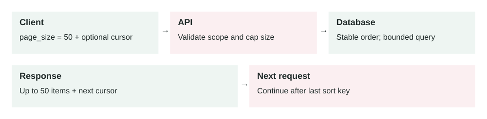

Lesson 0010 · API Optimization

# API Pagination

Each request reads a bounded page. A stable sort key needs a tie-breaker, such as an ID. A cursor does not bypass authorization or automatically guarantee a snapshot across pages.

Pagination splits a large list response into smaller pages so APIs stay fast, predictable, and safer under real production load.

## The problem it solves

List endpoints are dangerous when they are unbounded. An endpoint like `GET /orders` may be fine with 500 rows, but painful with 50 million rows. A single request can consume too much database time, memory, network bandwidth, and client processing.

Pagination forces the API to return a controlled number of items. The client asks for the next page only when it needs more data.

Client requests page → API validates page size → Database fetches bounded rows → API returns items + next page token

## How it works

1.  The client calls a list endpoint with a requested page size.
2.  The API applies a maximum page size to protect the system.
3.  The database fetches one bounded slice of results.
4.  The API returns the items and a cursor or page token for the next page.
5.  The client sends that token to continue from the previous position.
6.  The API stops returning a next token when there are no more results.

Good pagination is not only a UI feature. It is a system protection mechanism. It keeps each request small enough to measure, retry, cache, rate limit, and debug.

## Main components

-   **Page size:** the number of items requested, with a server-side maximum.
-   **Cursor or page token:** an opaque value that tells the API where to continue.
-   **Stable ordering:** a predictable sort order so items are not skipped or duplicated.
-   **Index:** a database index that supports the filter and order used by the list endpoint.
-   **Response metadata:** data such as `next_page_token`, count hints, or links.
-   **Rate limits:** protection against clients crawling too aggressively.

## Offset vs cursor pagination

Offset pagination uses `limit` and `offset`, such as `?limit=50&offset=1000`. It is simple, but it gets slower on deep pages because the database may still need to walk past many skipped rows. It can also duplicate or skip items when rows are inserted or deleted while the user is paging.

Cursor pagination uses a stable position, such as the last seen `created_at` and `id`, wrapped in an opaque token. It is usually better for large, changing datasets because it continues from a known item instead of counting skipped rows.

## Example 1: order history API

A customer opens their order history. The app calls `GET /orders?page_size=25`. The API returns the latest 25 orders and a `next_page_token`. The mobile app only fetches more if the customer scrolls.

The database uses an index like `(customer_id, created_at DESC, id DESC)`. This matches the filter and ordering. The API avoids loading years of history when the user only wants the first screen.

## Example 2: production export incident

A reporting endpoint returns all events for an account. One enterprise account has 90 million events. At 9:00 AM, three customers start exports at the same time. Each request tries to return every matching row. Database CPU reaches 98%, memory pressure rises, API containers time out, and unrelated dashboards become slow.

The fix is to make the endpoint paginated and move full exports to an async job. Interactive APIs return small pages. Large exports create a background task, stream data in chunks, store the file in object storage, and notify the user when it is ready. Pagination protects the request path; queues handle the long-running export.

## When to use it

-   An endpoint returns a list that can grow over time.
-   Clients display scrollable or table-based data.
-   The query reads from a large table, search index, or external API.
-   You need predictable latency and memory usage per request.
-   You want APIs that remain safe as customers grow from small to large accounts.

## When not to use it

-   The response is always tiny and bounded by business rules.
-   The client truly needs a complete export; use an async export flow instead.
-   The endpoint returns a single aggregate value, not a list of items.
-   The data is static and small enough to cache as one object safely.

## Implementation considerations

-   Always enforce a server-side maximum page size.
-   Use cursor pagination for large or frequently changing datasets.
-   Use a stable sort, often by `created_at` plus a unique `id` tie-breaker.
-   Make page tokens opaque so clients do not depend on internal database details.
-   Validate filters and sort fields; unsupported combinations can create slow queries.
-   Avoid expensive total counts on large datasets unless the product truly needs them.
-   Align database indexes with the endpoint's filters and order.

## Security considerations

-   Apply authorization before pagination so users cannot page through data they should not see.
-   Sign or encrypt page tokens if they include sensitive internal state.
-   Do not expose raw database IDs or query details inside readable tokens when avoidable.
-   Rate limit pagination to prevent scraping and expensive full-table crawling.
-   Keep filters tenant-scoped so one customer cannot infer another customer's data volume.

## Reliability concerns

-   Offset pagination can skip or duplicate rows when data changes during traversal.
-   Cursor tokens can expire if the underlying sort key disappears or access changes.
-   Changing default sort order can break clients that store old tokens.
-   Deep pagination can still be expensive if the index does not match the query.
-   Clients may retry pages, so reads and billing side effects must be safe.

## Performance and cost

Pagination reduces API latency, memory usage, database work, response size, and bandwidth. It also lowers failure blast radius because one bad request can only ask for a bounded amount of work. The cost is API complexity: clients must handle tokens, empty pages, retries, ordering, and partial results.

## Key trade-offs

-   **Simplicity vs scale:** offset pagination is easy, but cursor pagination scales better on large changing lists.
-   **Freshness vs stable traversal:** live data may change while the client pages through it.
-   **User convenience vs system safety:** "show all" is convenient, but can overload production systems.
-   **Detailed totals vs fast responses:** exact counts can be expensive on large filtered datasets.

## Common mistakes and edge cases

-   Allowing clients to request unlimited or extremely large page sizes.
-   Using offset pagination for very deep pages on huge tables.
-   Sorting only by a non-unique field, causing unstable page boundaries.
-   Returning exact total counts that require expensive full scans.
-   Letting page tokens reveal tenant IDs, raw SQL, or internal schema details.
-   Forgetting that deleted or newly inserted rows can change what the next page contains.
-   Using pagination as the only solution for exports instead of background jobs.

## Connection to previous lessons

[Database indexes](0007-database-indexes.md) make paginated queries fast only when the index matches the filter and sort. [Message queues](0005-message-queues.md) are better for full exports that should not block API requests. [Load balancing](0004-load-balancing.md) spreads API traffic, but it cannot protect the database from one unbounded query. [Containerization](0009-containerization.md) makes APIs easier to scale, but pagination reduces the work each container must perform. [Eventual consistency](0008-eventual-consistency.md) matters when paginated data changes while the client is traversing it.

## Design exercise

You own `GET /events` for an analytics product. Some accounts have 500 events; others have 500 million. Design the pagination contract: page size limits, cursor fields, default sort, index shape, token security, and what you would do when a customer asks for a full CSV export.

## Primary source

Read: [Google API Improvement Proposals: AIP-158 Pagination](https://google.aip.dev/158) .

Ask a follow-up question if any part of the design is unclear.
