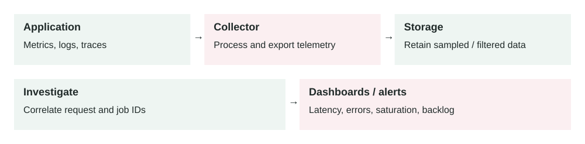

Lesson 0011 · Operations

# Observability

Telemetry connects symptoms to requests and dependencies. Collection itself consumes resources; protect sensitive fields and watch for missing or dropped telemetry.

Observability is the ability to understand what a production system is doing by looking at its external signals: logs, metrics, traces, and events.

## The problem it solves

Production systems fail in ways you did not predict. A database index may be missing, a queue may fall behind, a container may restart, or one customer may trigger a slow API path. Without observability, engineers guess.

Observability gives you evidence. It helps answer: what broke, who is affected, when did it start, where is the bottleneck, and whether the fix worked.

Service emits telemetry → Collector / agent → Storage → Dashboards, alerts, traces, logs

## How it works

1.  Application code and infrastructure emit telemetry.
2.  Telemetry is collected from services, containers, databases, queues, and load balancers.
3.  The data is enriched with labels such as service, route, region, customer tier, and version.
4.  Storage systems index the data for search, dashboards, alerting, and trace lookup.
5.  Engineers use the data to detect incidents, debug root causes, and verify fixes.

Good observability is not only collecting more data. It is collecting the right data with enough context to make production decisions quickly.

## Main components

-   **Metrics:** numeric time-series data, such as request rate, latency, error rate, CPU, and queue depth.
-   **Logs:** structured event records that explain what happened inside a service.
-   **Traces:** request journeys across services, useful for seeing where time was spent.
-   **Events:** important changes, such as deployments, config changes, autoscaling, or incident actions.
-   **Dashboards:** visual views of service health and business-critical paths.
-   **Alerts:** notifications based on symptoms that need human or automated action.

## Example 1: slow checkout request

A user reports that checkout is slow. Metrics show p95 checkout latency increased from 400 ms to 3 seconds. Logs show no clear application error. A distributed trace shows the payment service is fast, but the inventory service spends 2.4 seconds waiting on a database query.

The team checks the query plan and finds a missing index. The fix is not "add more containers"; the fix is a safe database index migration. Observability prevents the team from scaling the wrong layer.

## Example 2: production queue backlog

A billing system uses a queue to send invoices. Normally, workers process 300 messages per second and the oldest message age stays under 2 minutes. After a release, the oldest message age grows to 45 minutes while API traffic still looks healthy.

Metrics show worker error rate increased. Logs show the new code rejects some invoice payloads. Traces show retries hammer the same downstream CRM. The team rolls back the worker image, moves poison messages to a dead-letter queue, and adds a schema compatibility test. Without queue observability, users might only notice hours later when invoices do not arrive.

## When to use it

-   Every production service needs basic observability before it is trusted.
-   You operate APIs, workers, databases, queues, containers, or scheduled jobs.
-   You need to debug failures across multiple services.
-   You need alerts based on user-visible symptoms, not only machine health.
-   You want to measure whether reliability, performance, and cost changes worked.

## When not to overdo it

-   A small internal script may not need full tracing and dashboards.
-   High-cardinality labels can explode cost without improving debugging.
-   Verbose logs can hide useful signals and leak sensitive data.
-   Too many alerts can train teams to ignore real incidents.

## Implementation considerations

-   Start with golden signals: latency, traffic, errors, and saturation.
-   Use structured logs with request IDs, service name, route, status, and safe business context.
-   Propagate trace IDs across services, queues, and background workers.
-   Record deployment and config-change events so incidents can be tied to changes.
-   Alert on symptoms, such as failed checkout rate, not only CPU or memory.
-   Define service-level objectives for critical user journeys.
-   Review dashboards during incidents and remove panels nobody uses.

## Security considerations

-   Do not log passwords, tokens, session cookies, payment data, or raw personal data.
-   Restrict access to logs and traces because they may reveal production behavior and customer context.
-   Scrub sensitive headers and payloads before telemetry leaves the service.
-   Keep audit logs for security-relevant actions separate from noisy debug logs.
-   Protect telemetry pipelines; attackers can hide activity by disabling or flooding them.

## Reliability concerns

-   Telemetry must not take down the app if the collector or vendor is unavailable.
-   Use sampling carefully so rare but important traces are not always dropped.
-   Monitor the observability pipeline itself: dropped logs, delayed metrics, and collector errors.
-   Keep alert thresholds tied to user impact and expected traffic patterns.
-   Run incident reviews to add missing signals discovered during real failures.

## Performance and cost

Observability has real cost. Logs, metrics, and traces consume CPU, network, storage, and vendor budget. The goal is not infinite data. The goal is enough high-quality telemetry to detect and debug production problems quickly. Use sampling, retention rules, label discipline, and aggregation to control cost.

## Key trade-offs

-   **Detail vs cost:** more telemetry helps debugging but increases storage and processing cost.
-   **Sampling vs completeness:** sampling reduces cost but can miss rare failures.
-   **Fast alerts vs noisy alerts:** sensitive alerts catch problems quickly but may create fatigue.
-   **Debug context vs privacy:** rich logs help engineers but can expose sensitive data if poorly designed.

## Common mistakes and edge cases

-   Logging unstructured text that cannot be filtered by service, request ID, or customer segment.
-   Alerting on CPU but missing user-facing error rate or latency.
-   Using high-cardinality labels, such as user ID, on every metric.
-   Forgetting background workers, queues, cron jobs, and migrations.
-   Collecting traces but not propagating trace IDs through async boundaries.
-   Keeping debug logs forever and creating avoidable cost and privacy risk.
-   Not marking deployments, making it harder to connect incidents to recent changes.

## Connection to previous lessons

[Load balancing](0004-load-balancing.md) needs target health, latency, and error metrics. [Message queues](0005-message-queues.md) need queue depth, oldest message age, retries, and dead-letter queue counts. [Containerization](0009-containerization.md) needs restart, CPU, memory, and image rollout visibility. [API pagination](0010-api-pagination.md) should reduce latency and database load, and observability proves whether it did. [Eventual consistency](0008-eventual-consistency.md) needs lag metrics and reconciliation checks.

## Design exercise

You own a checkout API, an inventory service, a payment service, and an invoice queue. Design the minimum observability plan: five metrics, three structured log fields, one trace you must capture, two alerts, and one dashboard that would help you debug a failed checkout incident.

## Primary source

Read: [OpenTelemetry Docs: Observability primer](https://opentelemetry.io/docs/concepts/observability-primer/) .

Ask a follow-up question if any part of the design is unclear.
