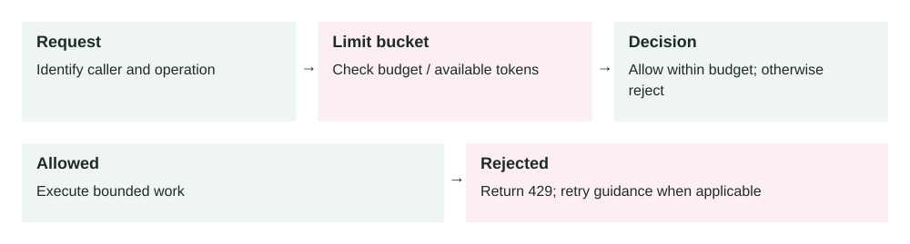

Lesson 0012 · Security and Reliability

# Rate Limiting

The decision branches into execution or rejection. Limits across many app instances need coordinated accounting when a strict shared budget is required.

Rate limiting controls how many requests or expensive actions a user, client, IP address, tenant, or service can perform in a period of time.

## The problem it solves

APIs can be overloaded by mistakes, aggressive clients, crawlers, attacks, or one large customer. Without limits, one caller can consume database CPU, queue capacity, third-party API quota, email or SMS budget, and container resources that other users need.

Rate limiting creates a controlled boundary. It does not make the system infinitely scalable, but it prevents one caller from taking more than their fair share and gives the platform time to recover.

Request → Identify caller → Check limit bucket → Allow or reject → Record decision and metrics

## How it works

1.  The API identifies the caller using API key, user ID, tenant ID, IP address, or service identity.
2.  The rate limiter checks how much quota that caller has used in a time window.
3.  If quota remains, the request continues and usage is recorded.
4.  If quota is exhausted, the API returns a clear rejection, commonly HTTP `429 Too Many Requests`.
5.  The response may include retry guidance such as `Retry-After`.

Good rate limiting protects scarce resources, not only request count. A cheap status check and a report export should not consume the same amount of quota.

## Main components

-   **Identity key:** who the limit applies to, such as user, tenant, token, IP, or route.
-   **Limit rule:** the allowed volume, such as 100 requests per minute.
-   **Algorithm:** the counting method, such as fixed window, sliding window, token bucket, or leaky bucket.
-   **Storage:** where counters or tokens are kept, often Redis or an API gateway.
-   **Response behavior:** what the caller receives when limited.
-   **Observability:** metrics and logs showing allowed, rejected, and near-limit traffic.

## Common algorithms

-   **Fixed window:** simple counters per minute or hour; easy but can allow bursts at window boundaries.
-   **Sliding window:** smoother counting over the last real interval; more accurate but more complex.
-   **Token bucket:** tokens refill over time; supports controlled bursts while preserving average rate.
-   **Leaky bucket:** requests drain at a steady rate; useful when downstream systems need smooth traffic.

## Example 1: public login API

A login endpoint is cheap when used normally but dangerous during credential stuffing. The API limits failed login attempts by IP address, username, and device fingerprint. After repeated failures, it slows or blocks attempts and may require extra verification.

This protects user accounts and database capacity. The limit must be careful: a shared office IP or mobile network can represent many real users, so the design should combine multiple signals instead of blocking only by IP.

## Example 2: production cost spike from exports

An analytics SaaS product has an export endpoint that starts background CSV jobs. One enterprise customer accidentally runs a script that starts 30,000 exports in an hour. Queue depth grows, object storage writes increase, email notifications spike, and the data warehouse bill jumps.

A better design limits export creation by tenant and by user, uses a separate quota for expensive exports, rejects excess requests with a clear retry time, and exposes current quota in the UI. The system also alerts when one tenant approaches a cost or job-creation threshold.

## When to use it

-   Any public API, login endpoint, webhook receiver, file upload, or export endpoint.
-   Endpoints that call paid third-party services such as SMS, email, maps, or AI APIs.
-   Multi-tenant systems where one tenant can affect others.
-   Background job creation endpoints that can flood queues.
-   Internal service-to-service APIs that need protection from retry storms.

## When not to rely on it alone

-   Rate limiting does not replace authentication, authorization, or input validation.
-   It does not fix slow queries, inefficient code, or missing pagination.
-   It does not stop distributed attacks unless limits are applied at the right layer.
-   It should not block critical internal recovery actions without a bypass plan.

## Implementation considerations

-   Limit by the right identity: user, tenant, API key, IP, route, or a combination.
-   Use different limits for cheap reads, expensive writes, exports, uploads, and login attempts.
-   Return helpful errors with `429`, retry timing, and documentation.
-   Keep counters in a fast shared store if many app instances enforce the same limit.
-   Use fail-open or fail-closed deliberately if the limiter storage is unavailable.
-   Add admin controls for temporary quota increases and emergency blocks.
-   Test clients to make sure they back off instead of retrying harder.

## Security considerations

-   Apply strict limits to authentication, password reset, invite, OTP, and token creation endpoints.
-   Do not trust headers such as `X-Forwarded-For` unless set by your trusted proxy.
-   Protect against quota bypass through multiple API keys, accounts, regions, or paths.
-   Keep rate-limit decisions auditable for abuse investigation.
-   Avoid revealing too much about account existence through different rate-limit messages.

## Reliability concerns

-   The limiter itself must be fast and highly available.
-   A centralized limiter can become a bottleneck if every request depends on it.
-   Retry storms can happen when many clients receive errors and retry at the same time.
-   Clock drift can affect window-based algorithms across distributed systems.
-   Bad limits can block real users during traffic spikes or incidents.

## Performance and cost

Rate limiting improves system stability by reducing overload before expensive work starts. It can lower database load, queue backlog, storage writes, and third-party service bills. The cost is extra infrastructure, storage lookups, operational tuning, and occasional customer support when legitimate users hit limits.

## Key trade-offs

-   **Protection vs usability:** strict limits protect the system but can block legitimate bursts.
-   **Simplicity vs fairness:** IP-based limits are simple but unfair for shared networks and weak against distributed clients.
-   **Central accuracy vs latency:** a shared limiter is more consistent but adds a network dependency.
-   **Fail-open vs fail-closed:** fail-open preserves availability, while fail-closed protects resources during limiter failures.

## Common mistakes and edge cases

-   Using one global request limit for both cheap and expensive endpoints.
-   Forgetting tenant-level limits in a multi-tenant system.
-   Letting retries bypass limits and amplify an outage.
-   Applying limits after the expensive database query has already run.
-   Not telling clients when to retry, causing aggressive retry loops.
-   Blocking all users behind a shared NAT or corporate proxy.
-   Not monitoring near-limit traffic before users start failing.

## Connection to previous lessons

[API pagination](0010-api-pagination.md) bounds response size; rate limiting bounds request frequency and expensive actions. [Observability](0011-observability.md) shows whether limits are protecting the system or hurting real users. [Message queues](0005-message-queues.md) need job creation limits so producers do not overwhelm workers. [Load balancing](0004-load-balancing.md) spreads traffic, but rate limiting decides whether traffic should be accepted at all. [Database indexes](0007-database-indexes.md) make queries faster, but limits prevent expensive query abuse.

## Design exercise

You run a public API with login, search, file upload, and report export endpoints. Design a rate-limit plan: what identity keys would you use, which endpoints need separate limits, what happens when Redis is down, what response do clients receive, and which metrics prove the limits are working?

## Primary source

Read: [OWASP API Security: Unrestricted Resource Consumption](https://owasp.org/API-Security/editions/2023/en/0xa4-unrestricted-resource-consumption/) .

Ask a follow-up question if any part of the design is unclear.
