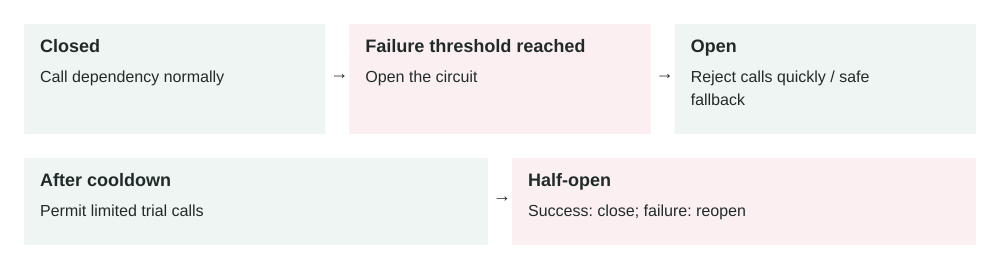

Lesson 0013 · Reliability

# Circuit Breakers

The breaker uses recent failures to change state. Half-open probes test recovery; a fallback must preserve business correctness, especially for payment operations.

A circuit breaker stops calling a dependency that is failing, waits for a recovery period, then carefully tests whether the dependency is healthy again.

## The problem it solves

Distributed systems depend on other services: databases, payment providers, search APIs, queues, email providers, and internal microservices. When one dependency becomes slow or fails, callers often retry. Those retries can make the failing dependency even worse and consume all caller resources.

A circuit breaker prevents this cascading failure. After enough failures, it temporarily fails fast instead of sending more traffic to a dependency that probably cannot handle it.

Request → Circuit breaker → Healthy dependency: call it · Failing dependency: fail fast / fallback

## How it works

1.  **Closed:** calls flow normally while the dependency is healthy.
2.  **Failure tracking:** the breaker counts errors, timeouts, or slow responses.
3.  **Open:** after a threshold is crossed, calls fail fast without hitting the dependency.
4.  **Cooldown:** the breaker waits for a configured recovery period.
5.  **Half-open:** a small number of test calls are allowed.
6.  **Recover or reopen:** if test calls succeed, the breaker closes; if they fail, it opens again.

The core idea is simple: when a dependency is clearly unhealthy, stop adding pressure. Give it time to recover and protect the rest of your system.

## Main components

-   **Failure threshold:** how many failures or what error rate opens the breaker.
-   **Timeout:** how long the caller waits before treating the call as failed.
-   **Open duration:** how long the breaker fails fast before testing recovery.
-   **Half-open probes:** limited test calls used to check if the dependency recovered.
-   **Fallback:** a safe alternate response, cached result, queue, or graceful error.
-   **Metrics:** breaker state, rejected calls, dependency latency, and failure rate.

## Example 1: payment provider outage

A checkout service calls a payment provider. Normally the provider responds in 300 ms. During an outage, calls hang for 10 seconds and then fail. Without a circuit breaker, checkout containers fill with waiting requests, users retry, and the whole checkout API becomes slow.

With a circuit breaker, the checkout service opens the breaker after repeated failures. New payment attempts fail fast with a clear temporary error. The app can offer "try again later" or save the order as pending payment. The payment provider gets less traffic while it recovers.

## Example 2: production cascading failure

A recommendation service depends on a profile service. At peak traffic, the profile service starts timing out because a database read replica is overloaded. The recommendation service receives 8,000 requests per second and retries each profile call twice. That turns 8,000 failing calls into 24,000 calls per second.

The circuit breaker opens when the profile-service failure rate stays above 50% for one minute. Recommendation responses fall back to popular items instead of personalized items. User experience is degraded, but the site stays up and the profile service has room to recover.

## When to use it

-   A service calls a remote dependency that can fail or become slow.
-   Retries could overload the dependency or caller.
-   A fallback response is safer than waiting for a doomed request.
-   The dependency is shared by many callers and needs protection.
-   You want failures to be contained instead of spreading across the system.

## When not to use it

-   The operation is local, fast, and not likely to cause cascading failure.
-   Failing fast would be worse than waiting, such as a critical one-time admin action.
-   You have no safe fallback and the error would be confusing without product handling.
-   The real issue is missing timeouts; set timeouts before tuning circuit breakers.

## Implementation considerations

-   Set short, explicit timeouts for every remote call before adding retries or breakers.
-   Track failures by dependency and operation, not only globally by service.
-   Use bounded retries with jitter so callers do not retry in synchronized waves.
-   Choose fallbacks carefully: cached data, default response, queued work, or clear failure.
-   Expose breaker state in metrics and dashboards.
-   Make half-open probes small so recovery checks do not create another traffic spike.
-   Test dependency failure in staging or controlled production experiments.

## Security considerations

-   Do not bypass authorization or fraud checks as a fallback unless the business has approved that risk.
-   Do not expose internal dependency names, hostnames, or stack details in user-facing errors.
-   Be careful with cached fallback data; stale data can leak revoked permissions or old personal data.
-   Protect breaker controls because forcing breakers open or closed can affect availability.
-   Log enough to investigate incidents, but avoid logging secrets from failed dependency calls.

## Reliability concerns

-   A breaker threshold that is too sensitive can block healthy traffic during brief blips.
-   A threshold that is too loose can allow cascading failure before opening.
-   Fallbacks can become overloaded if every request suddenly uses them.
-   Half-open recovery can cause traffic bursts if too many instances test at once.
-   Different app instances may disagree on breaker state unless you design for shared or local state intentionally.

## Performance and cost

Circuit breakers reduce wasted work during failures. They save caller threads, database connections, queue capacity, network calls, and third-party API costs. The cost is added complexity: thresholds, fallback behavior, testing, dashboards, and product decisions for degraded states.

## Key trade-offs

-   **Availability vs completeness:** fallback responses keep the app usable but may be less complete.
-   **Fast failure vs user success:** failing fast protects systems but may reject requests that could have eventually succeeded.
-   **Local state vs shared state:** local breakers are simple, but shared breakers coordinate better across many instances.
-   **Protection vs false positives:** aggressive thresholds prevent overload but can open during short harmless spikes.

## Common mistakes and edge cases

-   Adding retries without timeouts or circuit breakers.
-   Retrying non-idempotent operations, such as payments, without idempotency keys.
-   Using the same breaker for cheap and expensive operations.
-   Opening the breaker on all errors, including client errors like HTTP 400.
-   Creating a fallback that quietly returns wrong business data.
-   Not alerting when a breaker opens, so degraded mode becomes invisible.
-   Letting every instance half-open at the same time and flood the dependency.

## Connection to previous lessons

[Rate limiting](0012-rate-limiting.md) protects your system from too much incoming traffic; circuit breakers protect it from failing outgoing dependencies. [Observability](0011-observability.md) is required to tune breaker thresholds and know when fallback mode is active. [Message queues](0005-message-queues.md) can be a fallback for work that can finish later. [Cache-aside](0001-cache-aside.md) can provide stale-but-safe fallback reads. [Eventual consistency](0008-eventual-consistency.md) helps explain why fallback data may be temporarily stale.

## Design exercise

Your checkout API calls payment, inventory, tax, and email services. Payment must be correct, inventory should be current, tax can retry briefly, and email can happen later. Design circuit breaker rules: timeout, failure threshold, fallback behavior, retry policy, and the alerts you would create for each dependency.

## Primary source

Read: [Microsoft Azure Architecture Center: Circuit Breaker Pattern](https://learn.microsoft.com/en-us/azure/architecture/patterns/circuit-breaker) .

Ask a follow-up question if any part of the design is unclear.
