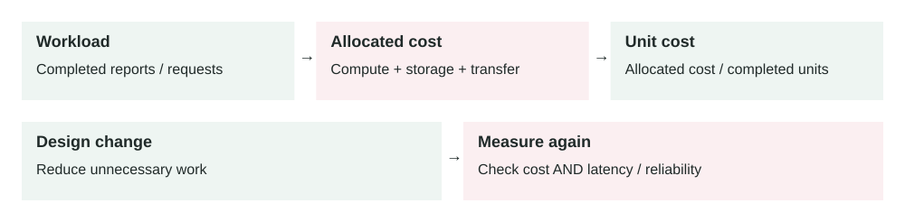

Lesson 0014 · Cost Optimization

# Cost-Aware Architecture

Compare cost per useful outcome, rather than only the total bill. A cheaper design can lose its advantage if it increases errors, delays, or operational effort.

Cost-aware architecture means designing systems so cost is visible, bounded, and connected to business value, not treated as a surprise after deployment.

## The problem it solves

Cloud systems can scale quickly, but bills can scale just as quickly. A slow query may require bigger databases. An unbounded API may transfer huge data. A queue backlog may create thousands of workers. A verbose logging setup may store terabytes of data nobody reads.

Cost-aware architecture gives engineers a practical question: what does it cost to serve one user action, one tenant, one API request, one order, one export, or one background job?

Traffic / workload → Resources used → Cost allocation → Unit cost → Architecture decision

## How it works

1.  Choose the business unit you care about, such as cost per order or cost per tenant.
2.  Measure the resources used by that unit: compute, database, cache, storage, network, logs, and third-party APIs.
3.  Tag or group infrastructure so cost can be traced to services, teams, environments, and customers.
4.  Set budgets and alerts for unexpected growth.
5.  Optimize the biggest cost drivers without breaking reliability, security, or user experience.
6.  Repeat as traffic, pricing, and architecture change.

The goal is not always the lowest bill. The goal is the lowest responsible cost for the required reliability, performance, security, and product value.

## Main components

-   **Unit cost:** cost per useful business unit, such as request, signup, order, invoice, or tenant.
-   **Cost allocation:** tags, labels, accounts, projects, or namespaces that connect spend to ownership.
-   **Demand management:** reducing unnecessary work through caching, pagination, batching, and limits.
-   **Supply management:** matching capacity to demand with autoscaling, right-sizing, and scheduling.
-   **Pricing model:** choosing on-demand, reserved, spot, serverless, or managed services deliberately.
-   **Review loop:** regular cost review, anomaly alerts, and architecture follow-up.

## Example 1: expensive report endpoint

A report endpoint costs very little for small customers but becomes expensive for enterprise tenants. Each request scans millions of rows, generates a PDF, stores a file, and writes detailed logs. The team first thinks it needs a larger database.

A cost-aware review shows the real issue: users repeatedly generate the same report. The team adds caching for completed reports, uses pagination for interactive views, and moves large exports to a queue. The database upgrade is delayed because repeated work is removed.

## Example 2: production bill spike

A media app launches a new image-processing feature. One viral customer uploads 2 million images in a weekend. Autoscaling works correctly, but compute cost rises 7x, object storage writes increase sharply, and observability cost grows because every processing step logs a large JSON payload.

The team introduces per-tenant quotas, cheaper lifecycle storage for originals, batch processing for low-priority transformations, log sampling for successful jobs, and alerts on cost per processed image. The feature stays available, but cost now grows closer to business value.

## When to use it

-   A workload is growing and infrastructure cost is becoming material.
-   A feature uses expensive resources such as data warehouses, AI APIs, SMS, storage, or high network transfer.
-   You operate a multi-tenant SaaS product where one customer can drive disproportionate cost.
-   You need to choose between scaling up, scaling out, caching, batching, or redesigning a flow.
-   You want engineering teams to own cost as part of production quality.

## When not to over-optimize

-   The service is early-stage and cost is tiny compared with product learning speed.
-   Optimization would add complexity that increases operational risk.
-   The savings are smaller than the engineering time required to achieve them.
-   The change would weaken security, reliability, or customer experience.

## Implementation considerations

-   Tag resources by service, environment, owner, and tenant tier where possible.
-   Track unit cost for key flows: signup, checkout, report, search, export, and background job.
-   Set budgets and anomaly alerts before the system grows.
-   Right-size databases, containers, queues, and caches using real utilization metrics.
-   Use autoscaling carefully; it solves capacity but can hide runaway demand.
-   Move expensive synchronous work to async jobs when the user does not need an immediate result.
-   Review observability retention, high-cardinality labels, and verbose logs regularly.

## Security considerations

-   Do not cut security controls just to lower cost.
-   Protect billing dashboards and cost allocation data because they reveal architecture and customer behavior.
-   Set quotas for abuse-prone paid actions such as SMS, email, AI calls, exports, and file processing.
-   Use least privilege for cost tools that can modify budgets, resources, or reservations.
-   Keep audit logs for cost-impacting admin actions like quota increases and resource changes.

## Reliability concerns

-   Aggressive downscaling can cause cold starts, queue delays, or failed requests.
-   Spot or interruptible capacity can save money but needs graceful interruption handling.
-   Reserved capacity can lower cost but may become waste if architecture changes.
-   Deleting "unused" resources without ownership review can break disaster recovery or audits.
-   Cost alerts should be actionable; noisy alerts get ignored like noisy reliability alerts.

## Performance and cost

Cost and performance are connected. Faster queries often use less CPU and I/O. Smaller responses reduce bandwidth and client work. Better caching reduces database pressure. But some cost reductions can hurt performance, such as under-provisioning a database or moving too much work to slow cold-start paths. Optimize with measurements, not guesses.

## Key trade-offs

-   **Lower cost vs simpler operations:** managed services cost more directly but can reduce engineering burden.
-   **On-demand flexibility vs committed discounts:** commitments reduce price but reduce flexibility.
-   **Autoscaling vs budget predictability:** autoscaling protects availability but can grow spend quickly.
-   **Retention vs investigation depth:** shorter telemetry retention saves money but limits incident analysis.

## Common mistakes and edge cases

-   Optimizing the largest bill line without checking unit cost or business value.
-   Ignoring network egress, logs, backups, snapshots, and third-party API fees.
-   Letting dev, staging, and preview environments run like production all weekend.
-   Using autoscaling without quotas, budgets, or anomaly alerts.
-   Buying commitments before workload patterns are stable.
-   Reducing observability so much that incidents become harder and more expensive.
-   Making one customer's heavy workload subsidized by all other tenants.

## Connection to previous lessons

[Cache-aside](0001-cache-aside.md) can reduce repeated database work. [API pagination](0010-api-pagination.md) reduces network and database cost per request. [Rate limiting](0012-rate-limiting.md) protects against runaway usage. [Observability](0011-observability.md) gives the measurements needed for unit cost. [Containerization](0009-containerization.md) and [horizontal scaling](0002-horizontal-scaling.md) make capacity flexible, but flexible capacity still needs cost guardrails.

## Design exercise

You run a SaaS analytics product. One dashboard request reads from Postgres, Redis, object storage, and a data warehouse. Define the unit cost you would track, the resource tags you need, three cost metrics, two budget alerts, and one architecture change you would try before buying a bigger database.

## Primary source

Read: [AWS Well-Architected Framework: Cost Optimization Pillar](https://docs.aws.amazon.com/wellarchitected/latest/cost-optimization-pillar/welcome.html) .

Ask a follow-up question if any part of the design is unclear.
